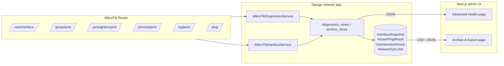
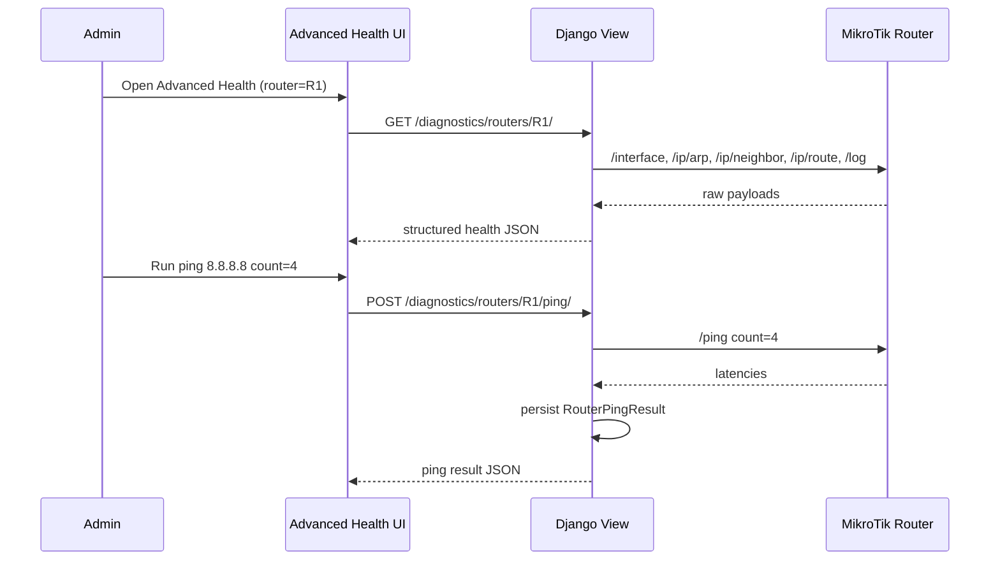

## Plan: MikroTik Advanced Health + Datewise Archive

**TL;DR** — Extend the `network` app with (a) a real-time *Advanced Health* troubleshooting screen that surfaces interface counters, ARP, neighbors, routing table, ping tool, and RouterOS log tail; and (b) a daily archive layer (interface snapshots + action/job logs + session history) with date-range CSV/JSON export. Frontend ships two new pages (`/network/advanced-health`, `/network/archive`) gated to admin roles.

**Steps**

1. **Backend — new domain models** (new migration under `apps/network/models.py`):
   - `InterfaceSnapshot` — per-router, per-day rollup of interface counters (rx/tx bytes, errors, drop, link state). Captured by `archive_interface_snapshot` task.
   - `RouterPingResult` — admin-triggered ping log row (target, latency, status, ran_by, timestamp). Persists results so they show up in the archive.
   - `NetworkArchiveDay` — small helper table that locks a calendar date for a tenant+router so we have a stable "is the day archived" flag.
   - Keep all existing `UserSession`, `UserSessionHistory`, `NetworkSyncJob` tables; the archive view reads them by `disconnected_at` / `created_at`.
2. **Backend — service layer** (`apps/network/services/mikrotik/`):
   - Extend `MikroTikInterfaceService` with `get_interface_counters_extended()` → `/interface/print` + `/interface/monitor-traffic` (one snapshot) for richer counters (rx/tx rate, drop, link-down count).
   - New `MikroTikDiagnosticsService` → `get_arp_table()`, `get_neighbor_list()` (`/ip/neighbor/print`), `get_route_table()` (`/ip/route/print`), `get_log_tail(max_lines=200)` (`/log/print`), `ping(target, count, timeout)` (`/ping`).
   - All methods follow existing pattern: open REST client, return `[]`/graceful error so admin UI never crashes.
3. **Backend — views + serializers** (`apps/network/diagnostics_views.py`, `apps/network/diagnostics_serializers.py`):
   - `RouterAdvancedHealthView` (`GET /api/v1/network/diagnostics/routers/<id>/`) → returns `{ interfaces, arp, neighbors, routes, log_tail, system }` in one round-trip, RBAC `CanControlDevices` (admin-only).
   - `RouterPingView` (`POST /api/v1/network/diagnostics/routers/<id>/ping/`) → records `RouterPingResult`.
   - `ArchiveQueryView` (`GET /api/v1/network/archive/?type=sessions|actions|interfaces&date_from&date_to&router_id&username`) → paginated results for the archive page; datewise granularity = calendar day (Asia/Dhaka by default).
   - `ArchiveExportView` (`GET /api/v1/network/archive/export/?type=…&format=csv|json&…`) → streams the same query as `csv` or `json`, Content-Disposition with date-stamped filename; uses `StreamingHttpResponse` so large ranges don't OOM.
4. **Backend — URL wiring** (`apps/network/urls.py`):
   - Add the four new routes with names `network-advanced-health`, `network-ping`, `network-archive-query`, `network-archive-export`.
5. **Backend — daily archive task** (`apps/network/tasks.py`):
   - New `archive_interface_snapshot(tenant_id?, router_id?)` — for each active router, take an extended interface snapshot and write a `InterfaceSnapshot(date=today, router=…, interfaces=[...])` row. Wire into existing `MikroTikInterfaceService` so it survives the live "no connection" case.
6. **Backend — admin permission gate**:
   - Reuse `CanControlDevices` for the diagnostics screens; add a narrow `CanExportNetworkArchive` permission for the export endpoint (admin-only). Documented in `permissions.py`.
7. **Backend — tests** (`apps/network/test_diagnostics.py`, `apps/network/test_archive.py`):
   - Mocked `MikroTikRESTClient` responses; cover `RouterAdvancedHealthView`, ping persistence, archive query date filter, CSV/JSON export content type + filename.
8. **Frontend — types & API** (`frontend/src/types/index.ts`, `frontend/src/lib/api.ts`):
   - Add `RouterAdvancedHealth`, `RouterPingResult`, `ArchiveRow`, `ArchiveQueryParams`, `ArchiveExportParams` types.
   - Add `ApiClient.getRouterAdvancedHealth(id)`, `pingRouter(id, target, count)`, `queryArchive(params)`, `exportArchive(params)` (returns blob URL for downloads).
9. **Frontend — `Advanced Health` page** (`frontend/src/app/network/advanced-health/page.tsx`):
   - Layout: router selector on the left (uses `/api/v1/network/routers/`), tabbed right pane — *Interfaces*, *ARP*, *Neighbors*, *Routes*, *Ping*, *Log*.
   - Interfaces tab shows live counters with up/down badge, error count, comment; pull-to-refresh button.
   - Ping tab: input (target IP/host) + count, results stream into a list and persist via the new endpoint so they appear in the archive.
   - Log tab: last 200 RouterOS log lines, copy-to-clipboard.
   - Reuse existing UI primitives (`/components/ui/*`) + table patterns from `online-sessions/page.tsx`.
10. **Frontend — `Archive & Export` page** (`frontend/src/app/network/archive/page.tsx`):
    - Date range picker (default today → 7 days back), source filter (Sessions / Actions / Interface Snapshots), router filter, username search.
    - Paginated table of `ArchiveRow`; row actions show details in a side drawer.
    - "Export" toolbar buttons: **Download CSV**, **Download JSON**. Both call `exportArchive` and trigger a browser download with the date-stamped filename returned by the server.
11. **Frontend — sidebar** (`frontend/src/components/layouts/Sidebar.tsx`):
    - Add under the *Network Operations* group: `Advanced Health` (`/network/advanced-health`) and `Archive & Export` (`/network/archive`). Role-gate via `profile?.role` (Super Admin + Tenant Admin only).
12. **Verification**:
    - `cd backend && python manage.py makemigrations network && python manage.py migrate`
    - `pytest backend/apps/network/test_diagnostics.py backend/apps/network/test_archive.py -q`
    - `cd frontend && npm run lint && npx tsc --noEmit`
    - Manual: log in as admin → open Advanced Health → confirm interfaces/ARP/neighbors/routes/log tabs render with one seeded router; run a ping and see it persist; open Archive & Export → filter to today → export CSV and JSON, verify both files open and contain the expected rows.

**Relevant files**
- `backend/apps/network/models.py` — add `InterfaceSnapshot`, `RouterPingResult`, `NetworkArchiveDay`.
- `backend/apps/network/services/mikrotik/interfaces.py` — extend counters.
- `backend/apps/network/services/mikrotik/diagnostics.py` — NEW (ARP, neighbors, routes, log, ping).
- `backend/apps/network/services/mikrotik/__init__.py` — re-export.
- `backend/apps/network/diagnostics_views.py` — NEW.
- `backend/apps/network/diagnostics_serializers.py` — NEW.
- `backend/apps/network/archive_views.py` — NEW (query + export).
- `backend/apps/network/permissions.py` — add `CanExportNetworkArchive`.
- `backend/apps/network/urls.py` — register 4 new routes.
- `backend/apps/network/tasks.py` — `archive_interface_snapshot`.
- `backend/apps/network/migrations/0020_*` — generated.
- `frontend/src/types/index.ts` — new TS types.
- `frontend/src/lib/api.ts` — new client methods.
- `frontend/src/app/network/advanced-health/page.tsx` — NEW.
- `frontend/src/app/network/archive/page.tsx` — NEW.
- `frontend/src/components/layouts/Sidebar.tsx` — add 2 entries, role-gate.

**Diagrams**

**Verification**
1. `pytest backend/apps/network/test_diagnostics.py backend/apps/network/test_archive.py -q` — all green.
2. `cd frontend && npx tsc --noEmit && npm run lint` — no errors.
3. Manual admin flow described in step 12.
