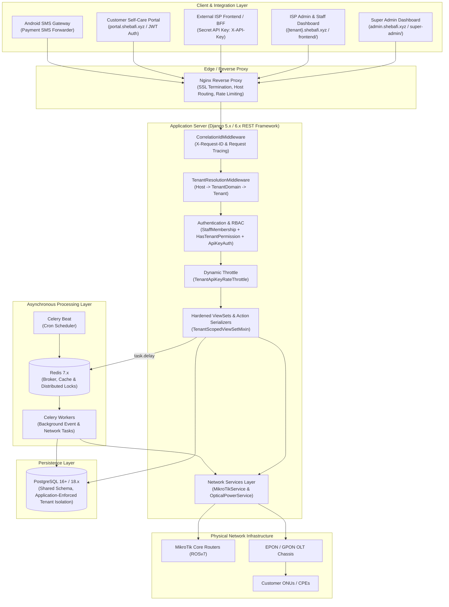
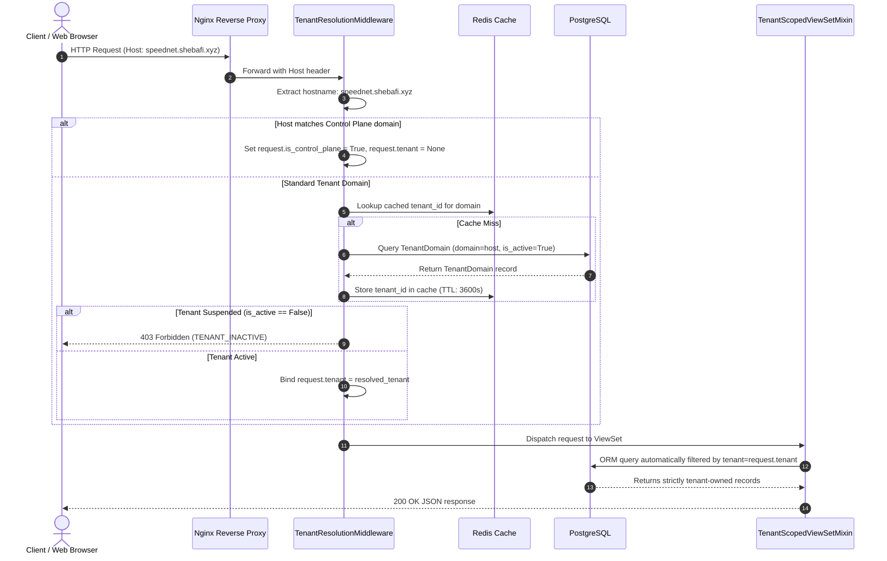
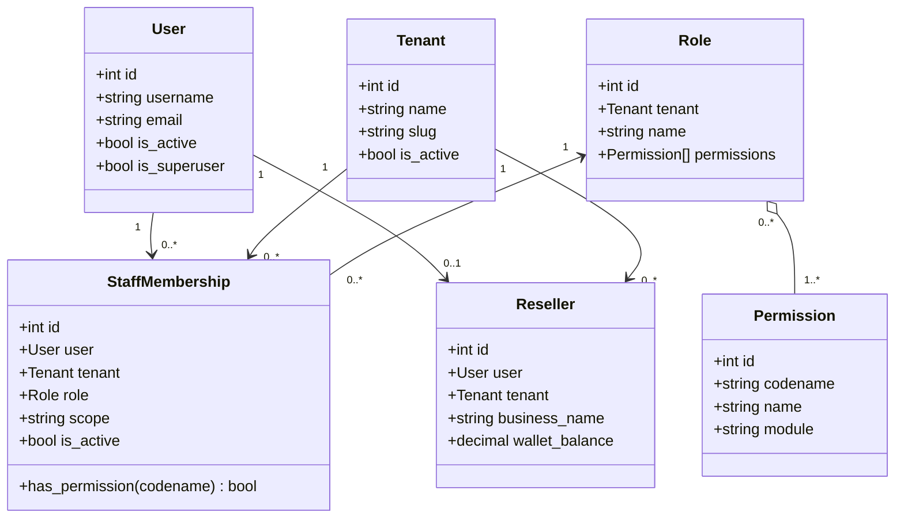
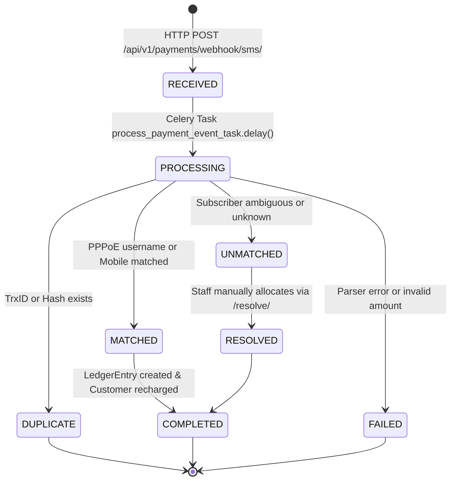
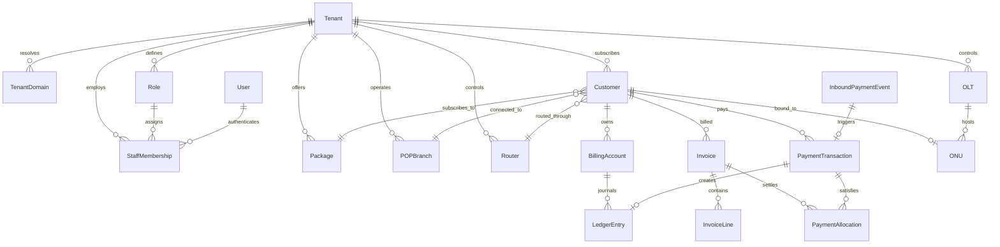

# Sheba ISP ERP — Software Architecture Specification

> **Document Type**: Canonical Software Architecture Document  
> **Repository**: `Taraldinn/sheba-erp`  
> **File**: `ARCHITECTURE.md`  
> **Status**: AUTHORITATIVE MASTER ARCHITECTURE SOURCE OF TRUTH  
> **Current Completed Baseline**: STAGES 0 THROUGH 8 VERIFIED  
> **Effective Date**: September 2026  

---

## 1. System Overview & Core Invariants

Sheba ISP ERP is a high-performance, multi-tenant Enterprise Resource Planning (ERP) and Network Automation platform engineered specifically for Internet Service Providers (ISPs) and Telecommunications Operators. It provides unified subscriber lifecycle management, RouterOS v7 MikroTik core routing automation, EPON/GPON OLT chassis management, double-entry financial ledger accounting, and a centralized SaaS multi-tenant control plane.

### The Five Fundamental Architectural Invariants

1. **Shared Database, Shared Schema Multi-Tenancy**:
   ```text
   ONE PostgreSQL Database + ONE Schema (public) + Many Tenants
   ```
   Under no circumstances shall database-per-tenant or schema-per-tenant routing be introduced. All tenant isolation is enforced at the application data layer via mandatory `tenant_id` foreign keys, `TenantScopedManager`, and server-derived tenant resolution.

2. **Server-Derived Multi-Tenancy**:
   ```text
   HTTP Host -> TenantDomain -> Tenant -> request.tenant
   ```
   Tenant identity is strictly derived from the incoming HTTP Host header matched against active database records. Clients cannot switch, declare, or override their tenant identity via request headers (`X-Tenant-ID`), query parameters (`?tenant_id=`), or request body payloads (`request.data["tenant"]`).

3. **Ledger as the Single Financial Source of Truth**:
   ```text
   Financial Request -> IdempotencyKey -> DB Transaction -> LedgerEntry -> Business State
   ```
   Denormalized account balances, customer statuses, and expiry dates are disposable cached projections. The append-only, immutable `LedgerEntry` journal is the sole authoritative record of financial truth. Deletion of financial records is strictly forbidden; corrections must occur via explicit `Adjustment` entries.

4. **Service-Mediated Network Operations**:
   ```text
   Client/Frontend -> Backend REST API -> Network Service Layer -> MikroTik / OLT Hardware
   ```
   Direct browser-to-router communication is prohibited. All router commands, traffic telemetry, and provisioning tasks pass through Django network services with credential encryption at rest and server-side SSRF validation.

5. **Asynchronous Non-Blocking Execution**:
   ```text
   HTTP Request -> Validate & Persist Inbound Event -> Celery Queue -> Redis -> Background Worker
   ```
   External network polling, payment gateway webhook mutations, SMS broadcasting, and bulk subscription expirations must never block synchronous HTTP request-response cycles.

---

## 2. Architecture Dependency Graph

To prevent architectural regressions, all downstream development adheres to the strict sequential dependency chain below:

```text
┌────────────────────────────────────────────────────────┐
│                        STAGE 0                         │
│               Architecture Stabilization               │ [DONE]
└───────────────────────────┬────────────────────────────┘
                            │
                            ▼
┌────────────────────────────────────────────────────────┐
│                        STAGE 1                         │
│              Tenancy & Domain Resolution               │ [DONE]
└───────────────────────────┬────────────────────────────┘
                            │
                            ▼
┌────────────────────────────────────────────────────────┐
│                        STAGE 2                         │
│           Authentication & Identity Migration          │ [DONE]
└───────────────────────────┬────────────────────────────┘
                            │
                            ▼
┌────────────────────────────────────────────────────────┐
│                        STAGE 3                         │
│            RBAC, Roles & Permission Scopes             │ [DONE]
└───────────────────────────┬────────────────────────────┘
                            │
                            ▼
┌────────────────────────────────────────────────────────┐
│                        STAGE 4                         │
│         Celery + Redis Infrastructure & Concurrency    │ [DONE]
└───────────────────────────┬────────────────────────────┘
                            │
                            ▼
┌────────────────────────────────────────────────────────┐
│                        STAGE 5                         │
│       Payments & Webhook Pipeline (State Machine)      │ [DONE]
└───────────────────────────┬────────────────────────────┘
                            │
                            ▼
┌────────────────────────────────────────────────────────┐
│                        STAGE 6                         │
│       Finance, Ledger & Billing Integrity (Invoices)   │ [DONE]
└───────────────────────────┬────────────────────────────┘
                            │
                            ▼
┌────────────────────────────────────────────────────────┐
│                        STAGE 7                         │
│        Networking Operations (MikroTik ROSv7 & OLT)    │ [DONE]
└───────────────────────────┬────────────────────────────┘
                            │
                            ▼
┌────────────────────────────────────────────────────────┐
│                        STAGE 8                         │
│            API Design & Security Hardening             │ [DONE]
└───────────────────────────┬────────────────────────────┘
                            │
                            ▼
┌────────────────────────────────────────────────────────┐
│                        STAGE 9                         │
│   Product / SaaS Features (Super Admin Separation)     │ [DONE]
└───────────────────────────┬────────────────────────────┘
                            │
                            ▼
┌────────────────────────────────────────────────────────┐
│                        STAGE 10                        │
│   External Frontend Platform & Production Hardening    │ [ACTIVE]
└───────────────────────────┬────────────────────────────┘
                            │
                            ▼
┌────────────────────────────────────────────────────────┐
│                        STAGE 11                        │
│                   Production Launch                    │
└────────────────────────────────────────────────────────┘
```

---

## 3. High-Level Architectural Topology



---

## 4. Multi-Tenancy Architecture

### 4.1 Domain-to-Tenant Resolution Flow



### 4.2 Tenant Isolation Enforcements
1. **No Client Tenant Switching**: Client headers (`X-Tenant-ID`, `X-Tenant-Key`) and query params (`?tenant_id=`) are stripped and disregarded.
2. **Body Payload Stripping**: Request data containing `tenant` or `tenant_id` fields are stripped by serializers (`read_only_fields = ('tenant',)`).
3. **`TenantScopedManager`**: All tenant-owned models utilize `TenantScopedManager`. Calling `.for_tenant(tenant)` returns `.none()` if `tenant` is empty.
4. **Prohibition of `Model.objects.all()`**: `Model.objects.all()` is strictly forbidden across all business endpoints. Global queries exist solely in the central control plane guarded by `IsCentralAdmin`.
5. **Composite Unique Constraints**: Every tenant model enforces database-level uniqueness composite with `tenant_id`:
   - `Customer`: `UNIQUE(tenant_id, pppoe_username)` and `UNIQUE(tenant_id, customer_code)`
   - `Package`: `UNIQUE(tenant_id, name)`
   - `POPBranch`: `UNIQUE(tenant_id, name)`
   - `Router`: `UNIQUE(tenant_id, ip_address)` and `UNIQUE(tenant_id, name)`
   - `OLT`: `UNIQUE(tenant_id, ip_address)` and `UNIQUE(tenant_id, name)`
   - `Role`: `UNIQUE(tenant_id, name)`
   - `StaffMembership`: `UNIQUE(user_id, tenant_id)`
   - `Invoice`: `UNIQUE(tenant_id, invoice_no)`
   - `BillingAccount`: `UNIQUE(tenant_id, customer_id)`

---

## 5. Identity, Authentication & RBAC Architecture

### 5.1 Identity Model Hierarchy



### 5.2 Scopes and Permissions
- **Capability Strings**: Fine-grained permissions (`customer.view`, `customer.recharge`, `router.manage`, `staff.manage`).
- **Data Scopes**:
  - `GLOBAL`: Full visibility across tenant.
  - `POP`: Scoped to assigned POP branches.
  - `AREA`: Scoped to assigned service areas.
  - `SELF`: Scoped to own created records.
  - `ASSIGNED`: Scoped strictly to tickets or work orders assigned to the staff member.

---

## 6. Asynchronous Task & Concurrency Architecture

### 6.1 Redis Distributed Locking
To prevent race conditions during customer recharge, payment matching, and hardware provisioning, the platform utilizes distributed locks via Redis:

```python
with distributed_lock(f"lock:recharge:{tenant.id}:{customer.id}", timeout=15):
    with transaction.atomic():
        # Lock acquired, perform atomic database ledger and billing account update
        pass
    # Router/device updates execute outside transaction.atomic() with post-commit
    # reconciliation tasks or compensating actions on failure
```

### 6.2 Task Conventions
- All background tasks are registered as `@shared_task` and accept `tenant_id` as their first parameter.
- Tasks re-query the database within `transaction.atomic()` to guarantee consistency of ledger state.
- External router/hardware calls are decoupled from the database transaction; idempotent post-commit reconciliation tasks handle hardware synchronization.
- Tasks implement exponential backoff retry policies for transient network failures.

---

## 7. Payments & Inbound Event State Machine



- **Immediate 202 Accepted**: Webhooks return immediately after persisting raw events.
- **Idempotency**: TrxID, SMS hash, and idempotency keys prevent double credit.
- **Staff Recovery**: Unmatched events are preserved in a safe state and resolved via staff UI.

---

## 8. Network Operations Architecture (MikroTik ROSv7 & OLTs)

```text
Views (/api/v1/routers/, /api/v1/onus/)
  │
  ▼
Network Service Layer (MikroTikService, OpticalPowerService)
  ├── Fernet Credential Decryption
  ├── SSRF Validation (Blocks 169.254.169.254, loopbacks, multicast)
  └── Timeout & Error Handling (5s connect/read timeout)
  │
  ▼
Hardware Protocol Clients (RouterOS REST Client, Telnet/SNMP Clients)
  │
  ▼
Physical Devices (MikroTik Routers, EPON/GPON OLTs)
```

- **Credential Protection**: Passwords and community strings are encrypted at rest with Fernet (`enc:...`) and unconditionally redacted from API output and audit logs.
- **Resilience**: Device timeouts and connection failures return structured 502/504 errors; worker threads never crash.

---

## 9. API Design & Security Hardening

- **Action Serializers**: Distinct serializers for mutations (`RechargeRequest`, `PaymentRequest`, `LockCustomer`, `ToggleInternet`, `RouterAction`, `ONUAction`).
- **Secret Redaction**: `pppoe_password` is write-only; API secrets, passwords, and private keys are popped on GET.
- **Rate Limiting**: Configured DRF rate throttles (`AnonRateThrottle`, `UserRateThrottle`, `ScopedRateThrottle`).
- **Security Headers**: `SECURE_CONTENT_TYPE_NOSNIFF`, `SECURE_BROWSER_XSS_FILTER`, `X_FRAME_OPTIONS = 'DENY'`, CORS headers configured.
- **OpenAPI 3.0**: Fully validated schema generated via `drf-spectacular` at [backend/schema.yml](backend/schema.yml).

---

## 10. Complete Entity Relationship Model



---

## 11. Verification Contract

Every change must satisfy:
1. `python manage.py check` passes with 0 issues.
2. `python manage.py test apps` passes with 0 failures (currently 153/153 passing).
3. `npm run build` compiles with 0 TypeScript/Turbopack errors (currently 48/48 routes).
4. `python manage.py spectacular --file backend/schema.yml --validate` exits with code 0.
