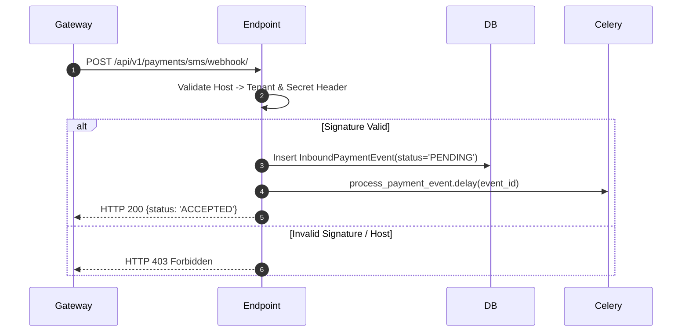

# Payment Webhooks & Ingestion

`IMPLEMENTED`

The SMS webhook endpoint ingests transaction confirmations forwarded by SMS forwarder Android devices or direct gateway webhooks.

---

## 1. Webhook Endpoint Specification

- **Method**: `POST`
- **Path**: `/api/v1/payments/sms/webhook/` (or alias `/api/v1/payments/webhook/sms/`)
- **Authentication**: HMAC Signature / Shared Secret (`X-Signature` or query token)
- **Tenant Resolution**: Derived exclusively from the HTTP `Host` header. Body parameters (`tenant`, `tenant_id`) are rejected.

---

## 2. Request Payload Format

```json
{
  "sender": "bKash",
  "message": "You have received Tk 800.00 from 01711223344. Ref: user_01. TrxID: 9K20A81J01 at 09/09/2026 14:30",
  "timestamp": "2026-09-09T14:30:15Z"
}
```

---

## 3. Webhook Lifecycle


