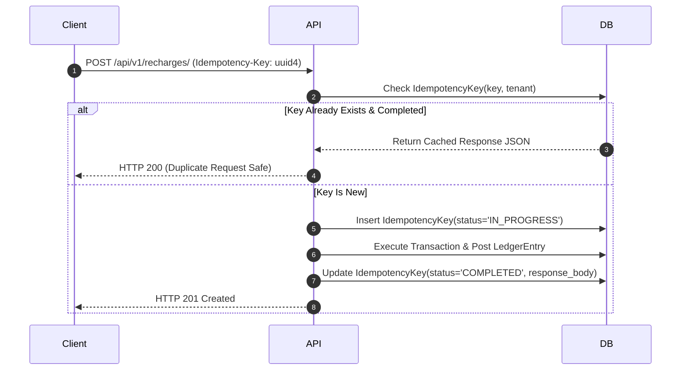

# Financial Ledger Architecture

`IMPLEMENTED`

Financial data integrity in Sheba ISP ERP is guaranteed by an append-only, immutable **double-entry financial ledger** housed in `apps.finance`.

---

## 1. Single Source of Financial Truth

In legacy billing systems, customer balances are stored as mutable integers or floats in a `balance` column, susceptible to race conditions and lost transaction history.

In Sheba ISP ERP:
```text
Financial Event -> Idempotency Key Check -> DB Transaction -> LedgerEntry -> Balance Projection
```
- **Balances are Projections**: The true financial balance of any customer is `SUM(credit) - SUM(debit)` across all `LedgerEntry` records.
- **Append-Only Journal**: Records in `LedgerEntry` cannot be updated or deleted via API.
- **Non-Destructive Reversals**: Reversals of recharges or payments never delete rows. They append a compensating `REVERSAL` debit `LedgerEntry`, update linked payment status to `REFUNDED`, and restore open invoice dues.
- **Advance Settlement Allocation**: Customer advance credits automatically settle open invoices via `apply_advance_to_invoice()`, producing explicit `PaymentAllocation` records and credit ledger entries while keeping net balance invariants consistent.
- **Auditable Adjustments**: Corrections, refunds, or waivers must be recorded as explicit `Adjustment` entries with an audit reference and staff signature.

---

## 2. Idempotency Key Protection (`IdempotencyKey`)

All mutating financial endpoints (`/api/v1/payments/`, `/api/v1/recharges/`, `/api/v1/adjustments/`) require an `Idempotency-Key` HTTP header.



---

## 3. Financial Models in `apps.finance`

| Model | Purpose | Invariants |
| :--- | :--- | :--- |
| `BillingAccount` | Root financial account for each customer | 1-to-1 with `Customer`, tenant-scoped |
| `LedgerEntry` | Immutable journal entry (Credit/Debit) | Cannot be deleted or updated once created |
| `InvoiceLine` | Line item detail on an `Invoice` | Belongs to an `Invoice`, tracks tax/discounts |
| `PaymentAllocation` | Maps payments to specific invoices | Ensures partial and full bill clearing |
| `Adjustment` | Manual credit/debit adjustments | Requires staff attribution, tenant-scoped |
| `IdempotencyKey` | Prevents duplicate processing | Scoped by tenant and expiration timestamp |
