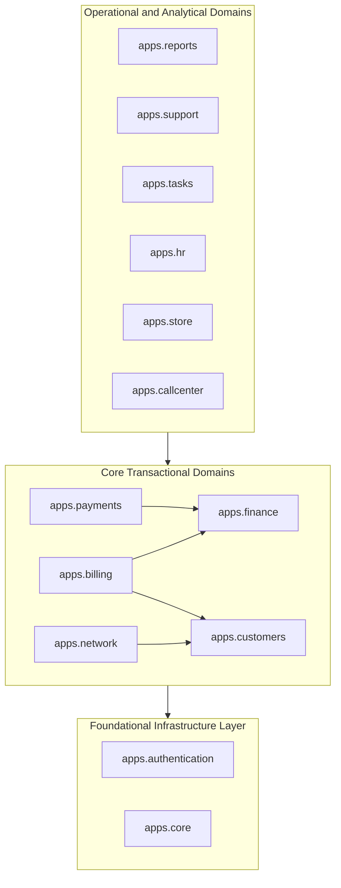

# Modular Monolith Architecture & Boundaries

`IMPLEMENTED`

The backend is constructed as a structured **modular monolith** divided into 13 cohesive Django applications within `backend/apps/`.

---

## 1. Domain Map & Responsibilities

| Module | Primary Responsibility | Data Ownership | Public Interfaces |
| :--- | :--- | :--- | :--- |
| `apps.core` | Tenancy, global settings, SaaS control plane, distributed locking | `Tenant`, `TenantDomain`, `AuditLog`, `SaaSPackage`, `DatabaseBackup` | `TenantResolutionMiddleware`, `distributed_lock` |
| `apps.authentication` | Identity, staff membership, RBAC roles/permissions, reseller margins | `StaffProfile`, `Role`, `Permission`, `StaffMembership`, `Reseller` | `IsTenantMember`, `HasPermissionScope`, `CurrentUserView` |
| `apps.customers` | Subscriber CRM, connection credentials, lifecycle states | `Customer` | `CustomerViewSet`, `CustomerQueryApiView` |
| `apps.billing` | Broadband packages, monthly invoices, auto-recharge rules | `Package`, `Invoice`, `Recharge`, `Offer`, `ResellerPricing` | `InvoiceViewSet`, `PackageViewSet`, `RechargeViewSet` |
| `apps.finance` | Single source of financial truth: double-entry ledger & idempotency | `BillingAccount`, `InvoiceLine`, `PaymentAllocation`, `LedgerEntry`, `Adjustment`, `IdempotencyKey` | `BillingAccountViewSet`, `LedgerEntryViewSet` |
| `apps.payments` | Gateway integrations, SMS webhook ingestion, transaction logs | `PaymentGateway`, `PaymentTransaction`, `PaymentAttempt`, `InboundPaymentEvent`, `SmsLog` | `SmsWebhookView`, `InboundPaymentEventViewSet` |
| `apps.network` | RouterOS v7 MikroTik automation, OLT chassis diagnostics, user sessions | `POPBranch`, `Router`, `OLT`, `ONU`, `UserSession` | `MikroTikService`, `OLTClient`, `RouterViewSet`, `OLTViewSet` |
| `apps.support` | NOC helpdesk, incident tickets, technician reply threads | `Ticket`, `TicketReply` | `TicketViewSet` |
| `apps.hr` | Employee records, attendance, leaves, payroll accounting | `Employee`, `Attendance`, `LeaveRequest`, `AdvanceSalary`, `PayrollRecord` | `EmployeeViewSet`, `PayrollRecordViewSet` |
| `apps.store` | Hardware catalog, fiber drop cables, SFP transceivers, stock entries | `ItemCategory`, `StoreItem`, `StockTransaction` | `StoreItemViewSet`, `StockTransactionViewSet` |
| `apps.tasks` | Field maintenance work orders, technician dispatch | `Task` | `TaskViewSet` |
| `apps.callcenter` | Call center logs, automated bill payment voice reminder broadcasts | `CallLog`, `VoiceSetting`, `VoiceTemplate` | `CallLogViewSet`, `VoiceSettingViewSet` |
| `apps.reports` | High-performance aggregated analytics, revenue trends, KPIs | *(Read-only analytical projections over core models)* | `DashboardAnalyticsView` |

---

## 2. Dependency Direction Rules

### Architectural Guardrails:
1. **No Circular Imports**: Lower-level foundational modules (`core`, `authentication`) must never import from higher-level modules (`reports`, `support`, `network`).
2. **Finance as Financial Sink**: `billing` and `payments` emit events or create ledger entries in `finance`; `finance` does not depend on specific gateway APIs.
3. **Network Isolation**: Direct network socket calls are confined to `apps.network.services.mikrotik` and `apps.network.services.olt`.
