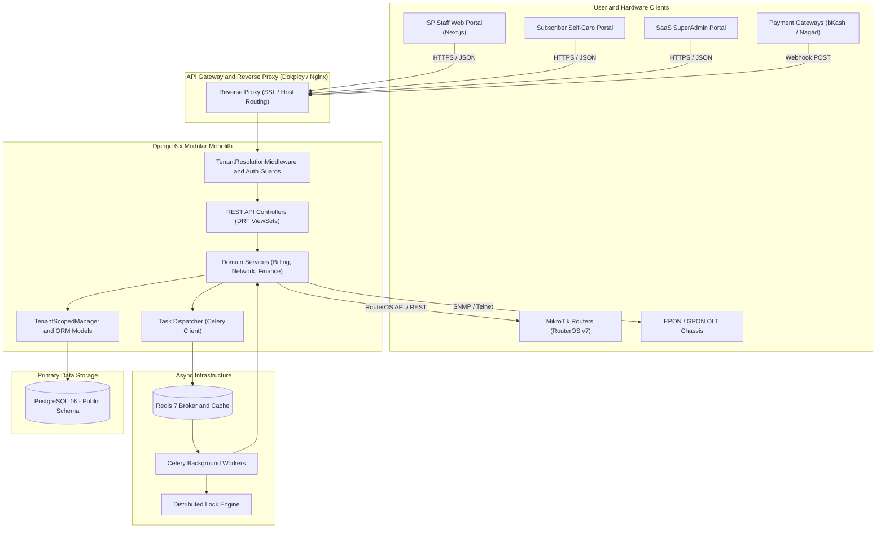
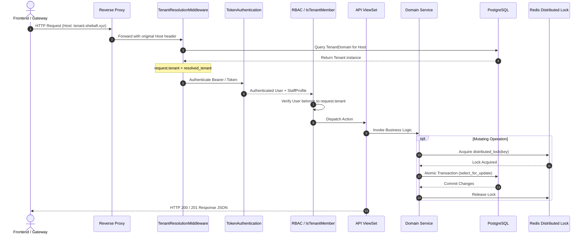

# System Architecture Overview

`IMPLEMENTED`

Sheba ISP ERP is architected as a **modular monolith** with a decoupled Next.js frontend, an asynchronous Celery task engine, a high-concurrency Redis caching layer, and a single-schema multi-tenant PostgreSQL database.

---

## 1. High-Level Context Diagram

---

## 2. Request-Response Lifecycle

Every HTTP request entering the backend undergoes a deterministic 7-stage processing pipeline:

---

## 3. Communication Protocols & Standards

- **Internal API**: JSON over HTTP REST. Standard DRF pagination (`count`, `next`, `previous`, `results`).
- **MikroTik RouterOS v7**:
  - Primary: REST API over HTTPS (`/rest/...`).
  - Secondary/Fallback: RouterOS API protocol (port 8728 / 8729 SSL).
- **OLT Management**:
  - Telemetry & Optical Diagnostics: SNMP v2c / v3, CLI scraping over SSH/Telnet.
- **Asynchronous Messaging**: Celery serialized JSON payloads routed over Redis queue.
