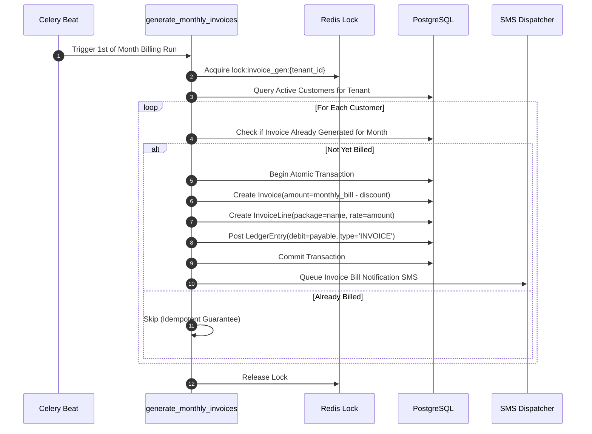

# Billing & Invoicing Lifecycle

`IMPLEMENTED`

Sheba ISP ERP automates recurring monthly subscription invoicing for thousands of subscribers while ensuring strict accounting isolation.

---

## 1. Monthly Recurring Billing Cycle

On the 1st of every calendar month, Celery triggers `generate_monthly_invoices(tenant_id)`.

---

## 2. Invoicing Business Rules

1. **Idempotent Billing**: A customer cannot receive more than one recurring subscription invoice for the same billing period (`period_start` to `period_end`).
2. **Discounts & Reseller Rates**: If customer has a recurring discount or belongs to a `Reseller` with custom `ResellerPricing`, the line rate reflects the agreed tiered pricing.
3. **Proration**: Mid-cycle new activations calculate prorated fees based on remaining days in the billing month.
