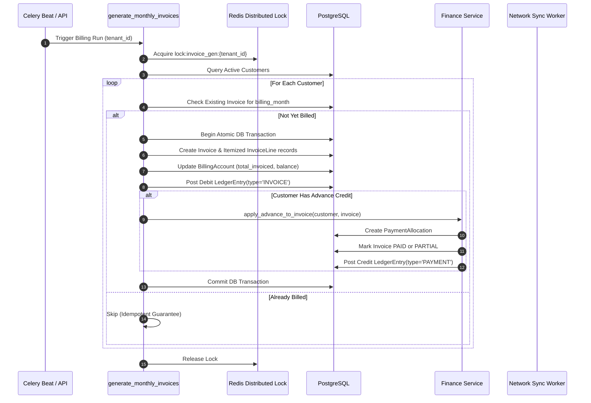
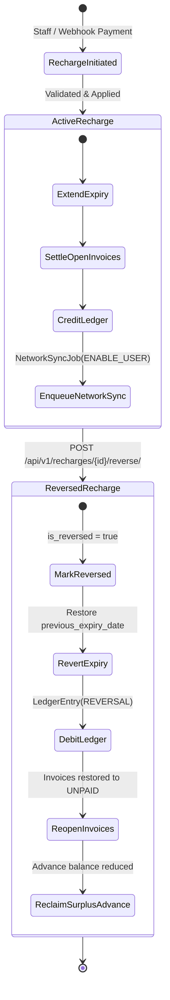

# Billing & Invoicing Lifecycle

`IMPLEMENTED`

Sheba ISP ERP automates recurring monthly subscription invoicing for thousands of subscribers while ensuring strict accounting isolation.

---

## 1. End-to-End Financial Lifecycle

The financial architecture guarantees atomic propagation across all stages:

```text
Invoice -> Invoice Lines -> Payment -> Payment Allocation -> Ledger -> Customer Balance -> Billing Status -> Network Sync
```



---

## 2. Invoicing & Discount Rules

1. **Idempotent Billing**: A customer cannot receive more than one recurring subscription invoice for the same `billing_month`.
2. **Itemized Line Computation**: For each `InvoiceLine`, the net charge is computed as:
   `line_total = (quantity * unit_price) - discount + tax_amount`
3. **Discount Precedence**: An explicit discount passed in the invoice creation payload (including `0.00`) is strictly preserved. If omitted, the default `customer.discount` is applied.
4. **Advance Auto-Settlement**: If a customer has an existing positive advance balance (`customer.advance_amount > 0`), the billing engine immediately executes `apply_advance_to_invoice()`, deducting advance funds to settle the new bill and creating an audited `PaymentAllocation`.
5. **Proration**: Mid-cycle activations calculate prorated fees based on remaining days in the billing month.

---

## 3. Recharges & Non-Destructive Reversals



- **Recharge Activation**: Recharges extend customer validity, clear outstanding invoices, post credit ledger entries, and schedule post-commit router sync jobs (`ENABLE_USER`).
- **Compensating Reversal**: Because financial records are immutable, reversing a recharge does not delete database rows. It appends a compensating `REVERSAL` ledger entry, marks the payment as refunded, rolls back the expiration date, re-opens affected invoices, and adjusts surplus advances.
