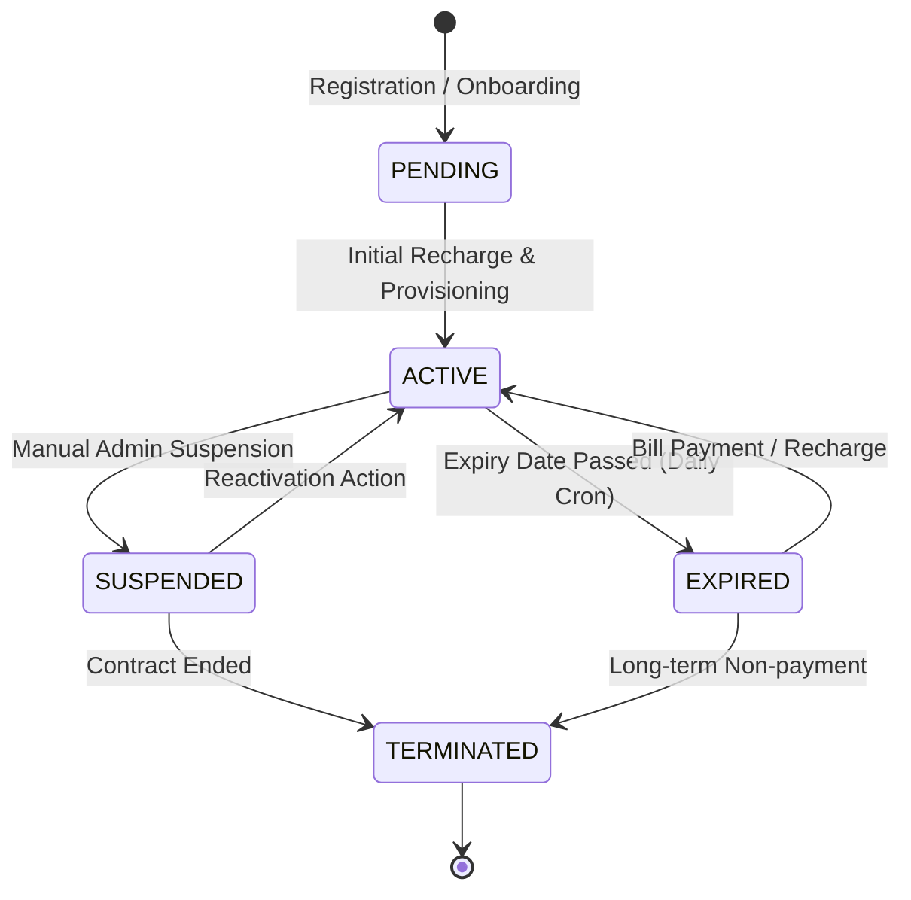

# Customer Lifecycle Workflow

`IMPLEMENTED`

The subscriber lifecycle is the core operational domain in Sheba ISP ERP.

---

## 1. Lifecycle State Machine

---

## 2. End-to-End Registration Flow

| Phase | Step | Description |
| :--- | :--- | :--- |
| **1. Trigger** | POST `/api/v1/customers/` | Staff submits customer registration form via `/customers`. |
| **2. Validation** | DRF Serializer | Validates unique `pppoe_username`, valid `package_id`, assigned `router_id`, and valid phone format (`01XXXXXXXXX`). |
| **3. Business Rules** | Domain Logic | Checks if package bandwidth is supported by router IP pool. Computes initial bill and expiry date. |
| **4. Database Changes** | Atomic Transaction | Creates `Customer` record, creates associated `BillingAccount`, generates initial invoice if applicable. |
| **5. External Operations** | MikroTik Provisioning | Contacts target MikroTik router via `MikroTikService.create_pppoe_user()`. Creates secret, password, and profile. |
| **6. Events / Tasks** | Celery Task | Dispatches welcome SMS broadcast task via `apps.payments.models.SmsLog`. |
| **7. Audit** | AuditLog Record | Emits `AuditLog` action `CUSTOMER_CREATE` with actor identity, IP, and assigned package. |
| **8. Success** | HTTP 201 Created | Returns complete `Customer` payload with connection credentials. |
| **9. Failure** | HTTP 400 / 500 | Rolls back database transaction. If router sync fails, flags customer status as `DESYNC` for admin attention. |
