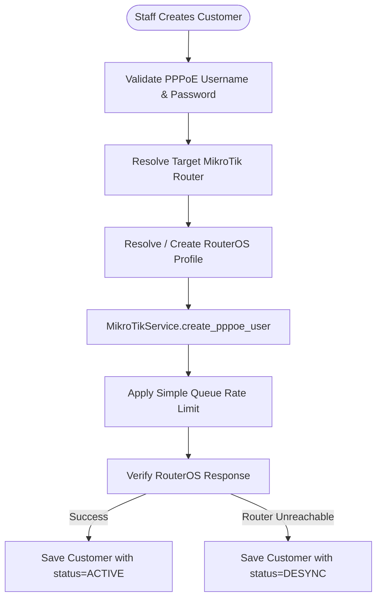

# Network Provisioning Lifecycle

`IMPLEMENTED`

Sheba ISP ERP translates high-level customer subscription choices directly into physical hardware configurations on MikroTik RouterOS v7 edge routers.

---

## 1. Provisioning Flow

---

## 2. MikroTik Hardware Operations

1. **PPPoE Secret Creation**:
   - Endpoint: `/ppp/secret/add` on RouterOS REST API.
   - Parameters: `name` (username), `password`, `service=pppoe`, `profile`, `remote-address` (if static IP).
2. **Bandwidth Queue Provisioning**:
   - Matches package upload/download tier (e.g. `20M/20M`).
   - Dynamically assigned via PPPoE Profile `rate-limit` parameter or dedicated Simple Queue.
3. **Graceful Disconnect (Re-Authentication)**:
   - When package is upgraded, the system removes the active tunnel session in `/ppp/active/remove`.
   - The customer router immediately reconnects with the new bandwidth parameters.
