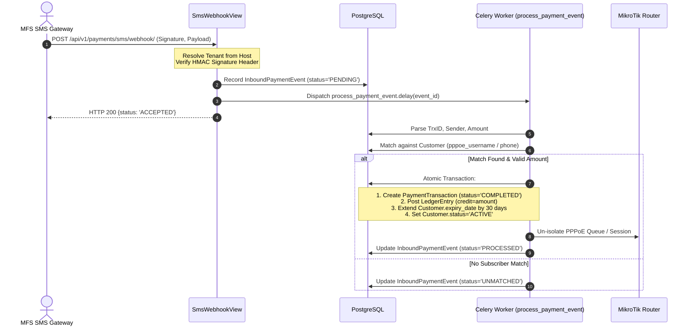

# Payment & Recharge Lifecycle

`IMPLEMENTED`

The payment pipeline supports both manual staff recharges and fully automated bKash / Nagad SMS webhook transaction processing.

---

## 1. Automated Webhook Ingestion & State Machine

When an SMS arrives from an MFS provider (e.g. bKash Merchant SMS forwarding):

---

## 2. Inbound Payment Event Statuses

- `PENDING`: Initial state upon HTTP webhook reception.
- `PROCESSED`: Successfully matched to subscriber, ledger credited, service extended.
- `UNMATCHED`: Payment received, but reference/phone does not match any active subscriber. Retained for manual staff allocation in `/payments`.
- `DUPLICATE`: Transaction ID already processed; discarded to prevent double crediting.
- `FAILED`: Parsing error or database transaction rollback.
