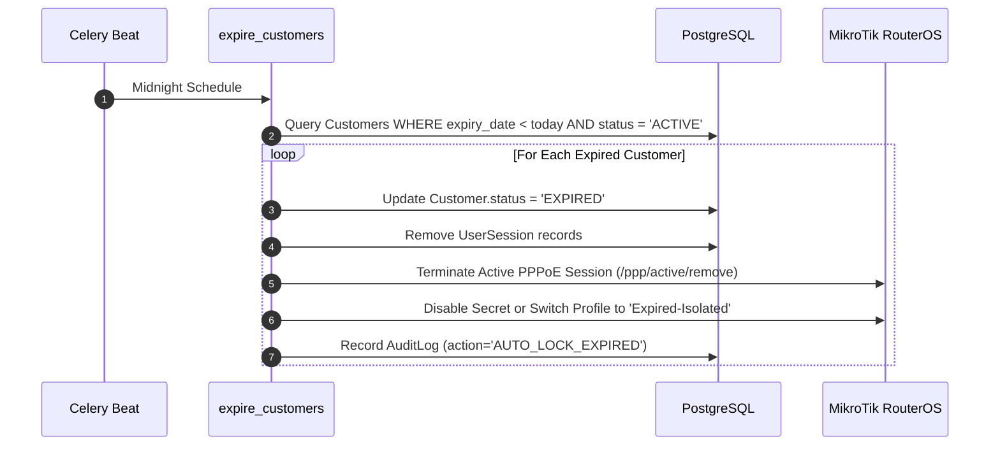

# Suspension & Reactivation Lifecycle

`IMPLEMENTED`

Maintaining cash flow requires reliable, non-blocking automation to disconnect delinquent subscribers and instantly restore access when payment is received.

---

## 1. Automated Expiration & Suspension Flow

Every midnight, the Celery Beat scheduler triggers `expire_customers(tenant_id)`.

---

## 2. Instant Reactivation Flow

When a subscriber pays via bKash/Nagad or staff processes a recharge:
1. `process_recharge` is dispatched.
2. The database updates `Customer.status = 'ACTIVE'` and increments `expiry_date`.
3. `MikroTikService.enable_pppoe_user()` is invoked immediately.
4. If an isolated session exists, it is kicked so the subscriber immediately renegotiates PPPoE with full high-speed Internet access.
