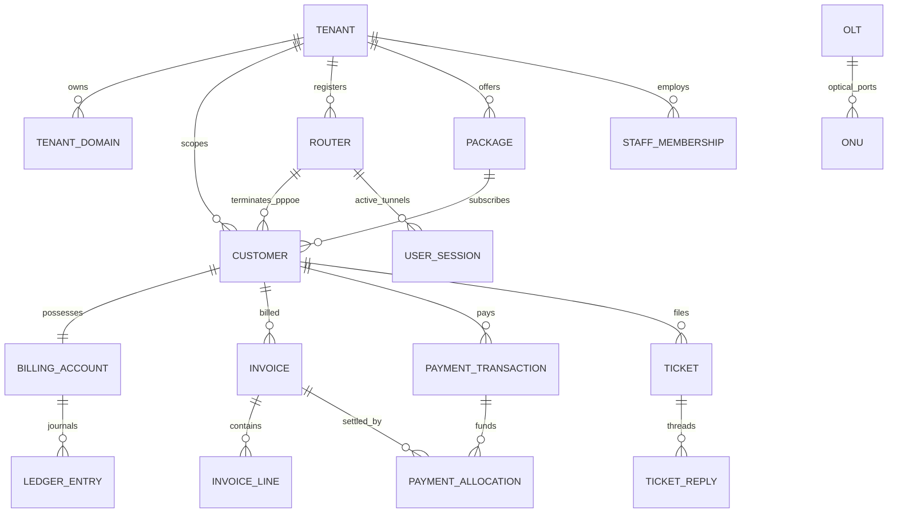

# Entity-Relationship (ER) Diagram

`IMPLEMENTED`

The following diagram depicts the primary entity relationships across the core transactional modules of Sheba ISP ERP.

```mermaid
erDiagram
    TENANT ||--o{ TENANT_DOMAIN : owns
    TENANT ||--o{ CUSTOMER : scopes
    TENANT ||--o{ ROUTER : registers
    TENANT ||--o{ PACKAGE : offers
    TENANT ||--o{ STAFF_MEMBERSHIP : employs

    ROUTER ||--o{ CUSTOMER : terminates_pppoe
    PACKAGE ||--o{ CUSTOMER : subscribes

    CUSTOMER ||--|| BILLING_ACCOUNT : possesses
    BILLING_ACCOUNT ||--o{ LEDGER_ENTRY : journals

    CUSTOMER ||--o{ INVOICE : billed
    INVOICE ||--o{ INVOICE_LINE : contains
    INVOICE ||--o{ PAYMENT_ALLOCATION : settled_by

    CUSTOMER ||--o{ PAYMENT_TRANSACTION : pays
    PAYMENT_TRANSACTION ||--o{ PAYMENT_ALLOCATION : funds

    CUSTOMER ||--o{ TICKET : files
    TICKET ||--o{ TICKET_REPLY : threads

    ROUTER ||--o{ USER_SESSION : active_tunnels
    OLT ||--o{ ONU : optical_ports
```
