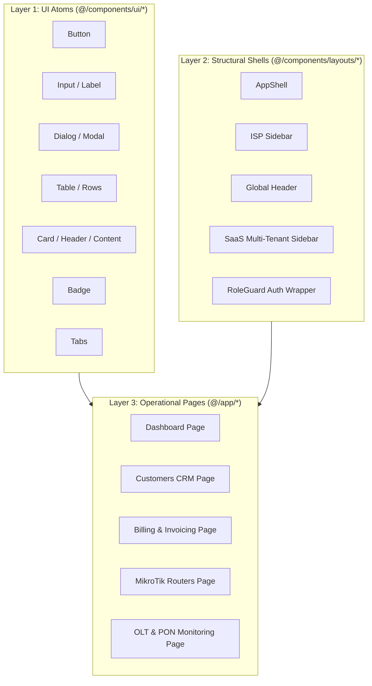
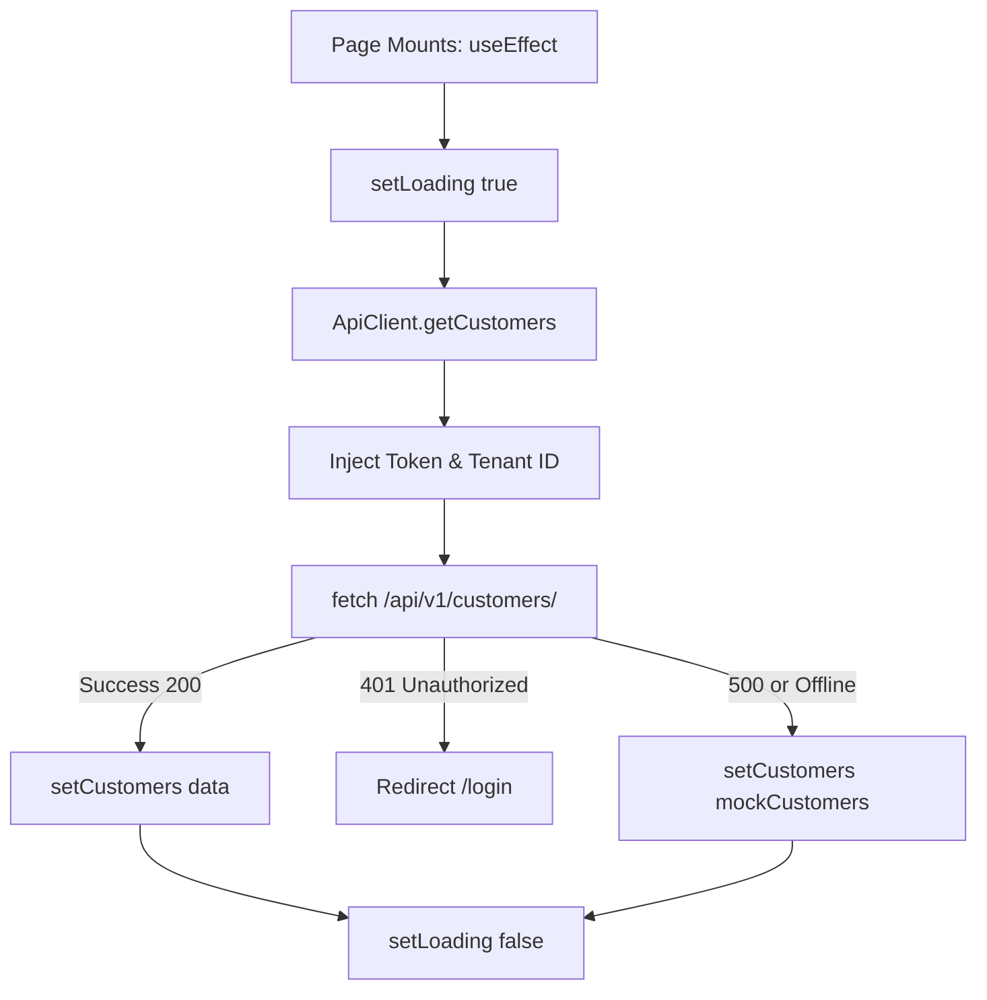

# Architecture, State & Data Fetching

`IMPLEMENTED`

The Sheba ISP ERP frontend is built on a clean, maintainable architecture designed around **predictable data flows**, **standard React hooks**, and **graceful fault tolerance**.

---

## 1. Component Hierarchy & Layering

The UI is structured in three strictly decoupled layers:



1. **Atomic Primitives (`src/components/ui/`)**: Built on accessible Radix UI components styled with Tailwind CSS v4. They contain zero business logic.
2. **Layout Shells (`src/components/layouts/`)**: Orchestrate navigation, active routes, tenant headers, notification triggers, and authentication boundaries.
3. **Composite Domain Pages (`src/app/`)**: Client components containing business logic, local filtering state, modal forms, and `ApiClient` calls.

---

## 2. State Management Strategy

Rather than relying on heavy external state machines (like Redux or Zustand), the ERP utilizes a lean, standard React state pattern:

| State Scope | Mechanism | Implemented Location | Purpose |
| :--- | :--- | :--- | :--- |
| **Local Screen State** | `useState`, `useCallback` | Within each page (`src/app/*/page.tsx`) | Form inputs, dialog open/close states, row selection for bulk actions. |
| **URL Parameter State** | `useSearchParams`, `useRouter` | `src/app/customers/page.tsx`, etc. | Tab selection (`?status=Active`), search terms, and filter persistence. |
| **Theme State** | `localStorage` + inline DOM class | `src/lib/use-theme.ts`, `src/app/layout.tsx` | Dark/light theme persistence (`sheba-theme` storage key). |
| **Auth & Role State** | `localStorage` | `src/components/auth/RoleGuard.tsx` | `sheba_token`, `sheba_user_role`, `sheba_tenant_id`. |
| **Alert & Notification State** | Custom Polling Hook | `src/hooks/useNotifications.ts` | Tracks unread count, popover logs, and mark-all-as-read state. |

### The `useNotifications` Hook
Located in `src/hooks/useNotifications.ts`:
- Maintains `notifications`, `unreadCount`, and `loading` states.
- Polls or triggers `ApiClient.getNotifications()` on mount.
- Provides `markAsRead(id)` and `markAllAsRead()` methods that immediately update local state and notify the backend API.

---

## 3. Data Fetching via `ApiClient`

All asynchronous operations flow through `frontend/src/lib/api.ts`.

### Standard Page Data Lifecycle:



### Key Implementation Patterns:
```typescript
// Standard page fetching pattern (as seen in src/app/customers/page.tsx)
const [customers, setCustomers] = useState<Customer[]>([]);
const [loading, setLoading] = useState(true);

const loadCustomers = async () => {
  setLoading(true);
  try {
    const data = await ApiClient.getCustomers();
    setCustomers(data);
  } catch (err) {
    console.error("Failed to fetch from API, falling back to mock fixtures:", err);
    setCustomers(mockCustomers);
  } finally {
    setLoading(false);
  }
};

useEffect(() => {
  loadCustomers();
}, []);
```

---

## 4. UI States: Loading, Empty & Error Handling

To maintain high visual quality, every page implements standard state representations:

1. **Loading State**:
   - Tabular screens display animated skeleton rows or pulsating placeholders.
   - Heavy dashboard cards show pulsing metric outlines until `loading === false`.
2. **Empty State**:
   - When filters or search queries return zero items, tables render a dedicated empty container:
   - Displays a descriptive icon (e.g., `Users`, `WifiOff`), a clear message (`"No customers found matching your criteria"`), and an action button (e.g., `"Clear Filters"` or `"Add Customer"`).
3. **Error Recovery**:
   - If an API action fails (e.g., customer recharge or router reboot), Sonner toasts display an actionable error message (`"Recharge failed: Insufficient balance"`).
   - Read operations automatically fall back to mock data so the dashboard layout never breaks during network interruptions.
