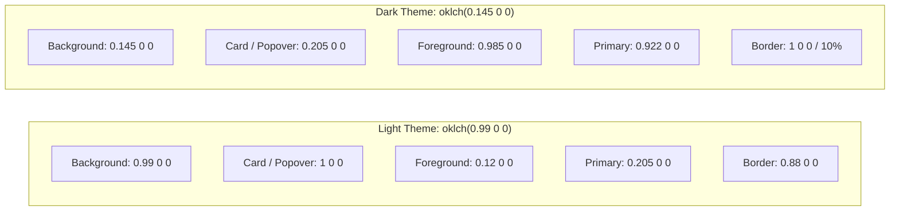

# Design System & Component Library

`IMPLEMENTED`

The Sheba ISP ERP design system is implemented in `frontend/src/app/globals.css` and `frontend/src/components/ui/`. It combines **Tailwind CSS v4** with **OKLCH color perceptual models**, **Space Grotesk** typography, and accessible **Radix UI** primitives.

---

## 1. Color System (OKLCH)

The color system uses OKLCH color representations to maintain uniform perceived lightness and contrast across monitors and mobile displays:



### Key Token Values (`globals.css`):
```css
/* Light Mode */
--background: oklch(0.99 0 0);
--foreground: oklch(0.12 0 0);
--card: oklch(1 0 0);
--primary: oklch(0.205 0 0);
--primary-foreground: oklch(0.985 0 0);
--border: oklch(0.88 0 0);
--muted: oklch(0.955 0 0);
--destructive: oklch(0.577 0.245 27.325);
--radius: 0.625rem; /* 10px */

/* Dark Mode */
--background: oklch(0.145 0 0);
--foreground: oklch(0.985 0 0);
--card: oklch(0.205 0 0);
--primary: oklch(0.922 0 0);
--primary-foreground: oklch(0.205 0 0);
--border: oklch(1 0 0 / 10%);
--muted: oklch(0.269 0 0);
--destructive: oklch(0.704 0.191 22.216);
```

---

## 2. Typography

- **Font Family**: Google Font `Space_Grotesk` loaded in `src/app/layout.tsx`.
- **CSS Variable**: `--font-sans: var(--font-sans)`.
- **Body Styling**: `antialiased font-sans text-foreground bg-background selection:bg-indigo-500 selection:text-white`.

---

## 3. UI Component Atoms (`src/components/ui/`)

All atomic controls are encapsulated in `frontend/src/components/ui/`:

### 1. `Button` (`button.tsx`)
Built with `class-variance-authority`:
- **Variants**: `default`, `destructive`, `outline`, `secondary`, `ghost`, `link`.
- **Sizes**: `default` (h-9 px-4), `sm` (h-8 px-3), `lg` (h-10 px-6), `icon` (h-9 w-9).

### 2. `Input` & `Label` (`input.tsx`, `label.tsx`)
- Standard 10px rounded input fields with focus ring outline (`ring-ring/50`).

### 3. `Select` (`select.tsx`)
- Radix UI unstyled select wrapped with custom portal dropdown, scroll buttons, and checkmark indicators.

### 4. `Dialog` (`dialog.tsx`)
- Modal overlay with animated entrance and exit (`data-[state=open]:animate-in`, `data-[state=closed]:animate-out`), used for:
  - Add Customer Modal (`/customers`)
  - Quick Recharge Dialog (`/customers`)
  - Add Package Modal (`/packages`)
  - Generate Invoices Dialog (`/billing`)
  - Add Router Dialog (`/routers`)

### 5. `Table` (`table.tsx`)
- Composable HTML table elements: `Table`, `TableHeader`, `TableBody`, `TableFooter`, `TableHead`, `TableRow`, `TableCell`, `TableCaption`.
- Responsive container with horizontal scroll support for dense data tables.

### 6. `Badge` (`badge.tsx`)
- Color-coded indicator tags for customer and ticket statuses:
  - **Active / Online**: `bg-emerald-500/10 text-emerald-500 border-emerald-500/20`
  - **Suspended / Due**: `bg-amber-500/10 text-amber-500 border-amber-500/20`
  - **Expired / Offline**: `bg-rose-500/10 text-rose-500 border-rose-500/20`

### 7. `Card` (`card.tsx`)
- Standard container with `bg-card text-card-foreground rounded-xl border border-border shadow-sm`.

---

## 4. Notifications & Alerts

Implemented in `src/components/notifications/`:
- **`NotificationPopover.tsx`**: Header bell icon triggering an accessible popover that displays the 5 most recent unread system notifications.
- **`NotificationPanel.tsx`**: Full drawer listing notifications categorized by severity (`info`, `warning`, `critical`), with one-click "Mark All as Read" action.
- **`Sonner` Toasts**: Injected at the root to render non-intrusive floating status toasts on successful mutations.

---

## 5. Visualizations (Recharts)

The dashboard and report views embed responsive charts configured with theme-aware palettes:
- **`AreaChart`**: 24-hour bandwidth telemetry displaying concurrent download/upload throughput in Mbps.
- **`BarChart`**: Monthly revenue collection vs. target targets.
