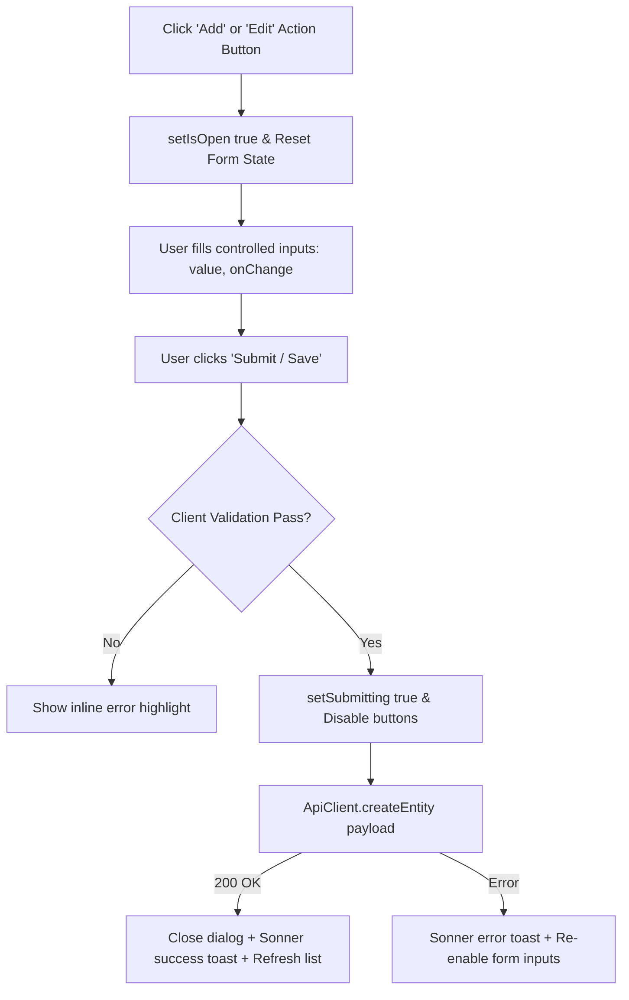

# Forms, Tables & UI Patterns

`IMPLEMENTED`

The Sheba ISP ERP frontend employs consistent design patterns across all 28 pages to ensure predictability and high developer velocity.

---

## 1. Form Architecture & Lifecycle

All entity creation and modification actions (such as adding a customer, updating a router, or generating invoices) are implemented as **modal forms** using the `Dialog` primitive:



### Controlled Input Example:
```tsx
// Pattern used across customer and package modals
const [formData, setFormData] = useState({
  full_name: "",
  mobile: "",
  package: "",
  billing_type: "Prepaid",
});

const handleSubmit = async (e: React.FormEvent) => {
  e.preventDefault();
  if (!formData.full_name || !formData.mobile) {
    toast.error("Please provide both name and mobile number");
    return;
  }
  setSaving(true);
  try {
    await ApiClient.createCustomer(formData);
    toast.success("Customer created successfully");
    setIsModalOpen(false);
    reloadCustomers();
  } catch (err) {
    toast.error("Failed to create customer");
  } finally {
    setSaving(false);
  }
};
```

---

## 2. Table Architecture & Filtering Pattern

Tables in the application follow a standardized 4-part structure:

1. **Header & Actions Bar**: Page title, total record count, primary creation button (e.g. `Plus` icon), and export trigger.
2. **Filter Toolbar**:
   - **Search Input**: Full-text search on names, usernames, phone numbers, or IPs.
   - **Status Tabs**: Fast status toggling (`All`, `Active`, `Expired`, `Suspended`).
   - **Context Dropdowns**: Zone, Package, or Reseller filters.
3. **Data Grid**:
   - Built using `@/components/ui/table`: `Table`, `TableHeader`, `TableRow`, `TableCell`.
   - Zebra striping or subtle hover highlighting (`hover:bg-muted/50`).
   - Compact density to fit large ISP operational datasets on standard laptop screens.
4. **Action Menu**: Each row features a `MoreHorizontal` dropdown containing contextual operations (View, Edit, Recharge, Suspend, Delete).

---

## 3. Bulk Selection & Batch Actions

For mass operations (such as bulk subscriber recharge, sending notification blasts, or extending grace days), tables implement multi-select state:

```tsx
// Bulk selection state pattern (src/app/customers/page.tsx)
const [selectedIds, setSelectedIds] = useState<string[]>([]);

const handleSelectAll = (checked: boolean) => {
  if (checked) {
    setSelectedIds(customers.map((c) => c.id));
  } else {
    setSelectedIds([]);
  }
};

const handleToggleRow = (id: string) => {
  setSelectedIds((prev) =>
    prev.includes(id) ? prev.filter((item) => item !== id) : [...prev, id]
  );
};
```

When `selectedIds.length > 0`, an animated floating **Bulk Action Toolbar** appears, displaying the selected count and actions like:
- **Bulk Recharge** (specify days and payment method)
- **Bulk Grace Extension** (extend expiry without marking unpaid)
- **Bulk Change Reseller**
- **Bulk SMS Broadcast**

---

## 4. UI Feedback States

### Loading States
- Individual buttons display a spinning indicator when executing asynchronous tasks (`<Button disabled={saving}>`).
- Full tables render an animated placeholder or skeleton rows while `loading === true`.

### Toast Notifications
All mutation outcomes trigger immediate visual confirmation using **Sonner**:
```tsx
import { toast } from "sonner";

// On success
toast.success("Router configuration synchronized successfully");

// On failure
toast.error("Failed to reboot router: Device timed out");
```
