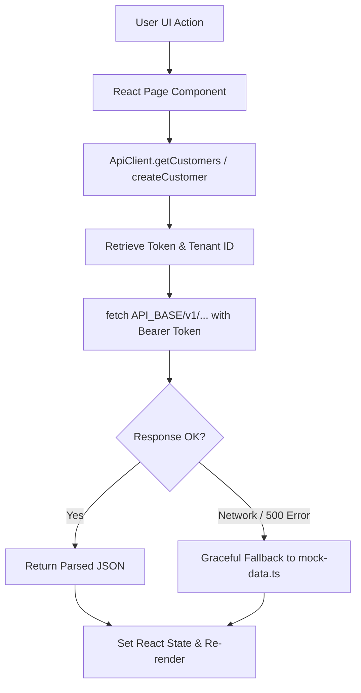

# Frontend Architecture Overview

`IMPLEMENTED`

The Sheba ISP ERP frontend is a high-performance, responsive single-page web application engineered with **Next.js 16.3.4 (App Router)** and **React 19.2.8**, utilizing **Tailwind CSS v4** with a custom **OKLCH design system**. It serves as the unified interface for ISP operations, subscriber management, network telemetry, billing reconciliation, customer self-service, and multi-tenant SaaS administration.

---

## 1. Technology Stack

The frontend utilizes a modern React 19 stack without bloated third-party state managers, leveraging native React hooks, custom client wrappers, and Radix UI primitives:

| Category | Technology | Version | Purpose |
| :--- | :--- | :--- | :--- |
| **Framework** | Next.js (App Router) | `16.3.4` | Server-rendered shell, client routing, Turbopack builds |
| **Runtime** | React / React DOM | `19.2.8` | Component model, hooks, concurrent rendering |
| **Styling** | Tailwind CSS | `v4.0.0` | Utility-first CSS engine with inline `@theme` tokens |
| **CSS Primitives** | Tw-Animate-CSS | `^1.4.0` | Keyframe micro-animations for cards and drawers |
| **UI Primitives** | Radix UI Primitives | Latest | Accessible unstyled dialogs, selects, dropdowns, tabs, popovers |
| **Icons** | Lucide React | `^1.38.0` | Consistent 24px icon set across all navigation and cards |
| **Charts** | Recharts | `^3.10.1` | Real-time bandwidth throughput areas, revenue bar charts |
| **Toasts** | Sonner | `^2.0.8` | Toast notifications for async action confirmations |
| **Typography** | Space Grotesk | Google Font | Clean, geometric sans-serif typeface |
| **Language** | TypeScript | `^5.0.0` | Strict typing for ERP entities, API payloads, and props |

---

## 2. Repository Structure

The complete frontend implementation resides in `frontend/`:

```text
frontend/
├── package.json               # Scripts, dependencies (Next 16, React 19, Tailwind v4)
├── next.config.ts             # Next.js configuration & compiler options
├── tsconfig.json              # Path aliases: @/* -> ./src/*
├── public/                    # Static brand assets, favicon, SVGs
└── src/
    ├── app/                   # Next.js App Router routes (28 operational pages)
    │   ├── layout.tsx         # Root HTML layout with Space Grotesk font & theme script
    │   ├── globals.css        # OKLCH color tokens, dark mode variants, scrollbars
    │   ├── page.tsx           # Primary ISP Dashboard & Executive KPI Center
    │   ├── login/page.tsx     # Staff & Admin authentication
    │   ├── customers/page.tsx # Customer CRM, PPPoE credentials, bulk actions
    │   ├── packages/page.tsx  # Bandwidth plans, speeds, MikroTik profiles
    │   ├── billing/page.tsx   # Monthly billing, invoice generation, auto-locks
    │   ├── payments/page.tsx  # Payment transactions, manual cash/bKash entry
    │   ├── network/page.tsx   # Core network infrastructure & device health
    │   ├── routers/page.tsx   # MikroTik RouterOS v7 sync & interfaces
    │   ├── olt/page.tsx       # Optical Line Terminals & ONU optical signal dBm
    │   ├── online-sessions/   # Live active PPPoE & Hotspot sessions
    │   ├── bandwidth/page.tsx # Bandwidth queue graphs & peak traffic analytics
    │   ├── topology/page.tsx  # Visual network node topology map
    │   ├── support/page.tsx   # Helpdesk ticketing, priority, comments
    │   ├── reports/page.tsx   # Financial, churn, and bandwidth report generation
    │   ├── inventory/page.tsx # Hardware stock, serial tracking, assignments
    │   ├── hr/page.tsx        # Employee directory, attendance, payroll
    │   ├── callcenter/page.tsx# Inbound/outbound call logs & CRM history
    │   ├── resellers/page.tsx # Reseller L1/L2 accounts, balance, pricing
    │   ├── branches/page.tsx  # Branch offices, zones, manager contacts
    │   ├── staff/page.tsx     # Internal staff directory & role permissions
    │   ├── tasks/page.tsx     # Field technician task dispatch
    │   ├── wallet/page.tsx    # Customer prepaid wallet ledger
    │   ├── offers/page.tsx    # Promotional discount campaigns
    │   ├── notifications/     # Broadcast alert logs & delivery status
    │   ├── configuration/     # ISP profile, RADIUS defaults, MikroTik configs
    │   ├── settings/page.tsx  # User profile, theme switcher, security
    │   ├── portal/page.tsx    # Subscriber self-service portal
    │   └── saas-admin/page.tsx# Multi-tenant SaaS control plane
    ├── components/
    │   ├── auth/              # RoleGuard.tsx role-based access wrapper
    │   ├── layouts/           # AppShell, Sidebar, Header, SaaSSidebar, SaaSHeader, PortalHeader
    │   ├── notifications/     # NotificationPopover.tsx, NotificationPanel.tsx
    │   └── ui/                # Reusable Radix/Tailwind atoms (button, dialog, table, card, badge, etc.)
    ├── hooks/
    │   └── useNotifications.ts# Polling & state hook for unread system alerts
    ├── lib/
    │   ├── api.ts             # 1,468-line strongly-typed ApiClient
    │   ├── mock-data.ts       # Comprehensive offline development mock datasets
    │   ├── use-theme.ts       # Theme persistence hook
    │   └── utils.ts           # Class merger (cn), currency formatters, date formatters
    ├── proxy.ts               # Local reverse proxy configuration for API endpoints
    └── types/
        └── index.ts           # 275+ lines of TypeScript definitions for all ERP entities
```

---

## 3. Application Entry Points

1. **`src/app/layout.tsx`**:
   - Injects the `Space_Grotesk` font variable (`--font-sans`).
   - Executes an inline blocking script in `<head>` to read `localStorage.getItem('sheba-theme')` or system media query, applying `.dark` immediately to prevent theme flash.
   - Mounts the `AppShell` component surrounding all page content.

2. **`src/components/layouts/AppShell.tsx`**:
   - Inspects `usePathname()`.
   - **Login & Portal Routes** (`/login`, `/portal`): Renders a clean full-viewport container without administrative sidebars.
   - **SaaS Control Plane Routes** (`/saas-admin`): Renders `SaaSSidebar` and `SaaSHeader` for platform administrators.
   - **Operational ISP Routes** (All other 26 pages): Renders the full `Sidebar` navigation and `Header` with search, tenant switchers, notifications, and profile menus.

---

## 4. Frontend ↔ Backend Communication

All network operations are centralized in `frontend/src/lib/api.ts` through the static `ApiClient` class:



### Communication Principles:
1. **Base URL**: Configured via `NEXT_PUBLIC_API_URL`, defaulting to `http://localhost:8000/api/v1`.
2. **Authentication Header**: Injected into every request:
   ```text
   Authorization: Token <sheba_token>
   X-Tenant-ID: shebafi
   Content-Type: application/json
   ```
3. **Resilient Mock Fallback**: If the Django backend is offline or an endpoint encounters a network error, `ApiClient` catches the exception and returns matching fixtures from `src/lib/mock-data.ts`. This ensures the UI remains fully interactive during local design and offline development.
