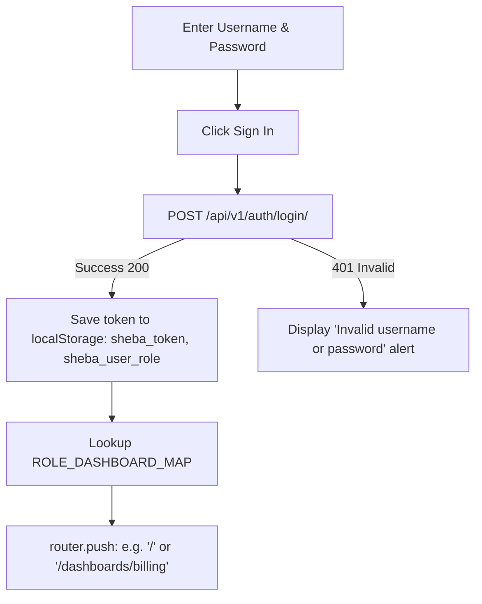

# Platform, Portal & Control Plane Pages

`IMPLEMENTED`

This section documents the public, subscriber-facing, administrative configuration, and multi-tenant control plane interfaces.

---

## 1. Customer Self-Service Portal (`/portal`)

### Purpose
Unauthenticated / subscriber-authenticated portal enabling retail broadband customers to check plan status, pay overdue invoices, conduct speed tests, and submit complaints without contacting support.

### Route & Layout
- **Route**: `/portal`
- **Layout**: Standalone Clean Layout (`PortalHeader`, no staff sidebar)
- **Role Guard**: `customer` or public token link

### Subscriber Interface Components:
```text
PortalPage
 ├── PortalHeader (Brand Logo, Connection Status Indicator, Logout/Login)
 ├── SubscriptionStatusCard (Current Package, Speed, Expiry Date, Remaining Days)
 ├── DueAmountBanner (Outstanding Balance with 'Pay Now' bKash/Nagad Action)
 ├── BandwidthUsageSummary (Monthly consumption in GB)
 ├── QuickActionsGrid
 │    ├── SpeedTestTrigger (Embedded speed diagnostic)
 │    ├── RaiseComplaintDialog (Subject, issue description, mobile contact)
 │    └── InvoiceDownload (PDF invoice receipts)
 └── RecentInvoicesList
```

---

## 2. Multi-Tenant SaaS Control Plane (`/saas-admin`)

### Purpose
Dedicated administration center for platform operators to manage ISP tenants, subscription tiers, plan limits, domain routing, and platform-wide revenue.

### Route & Layout
- **Route**: `/saas-admin`
- **Layout**: SaaS Control Plane Layout (`SaaSSidebar` + `SaaSHeader`)
- **Role Guard**: `super_admin` only

### Control Plane Capabilities:
```text
SaaSAdminPage
 ├── PlatformKPIs (Total Tenants, Active MRR, Total Managed Subscribers, Active Routers)
 ├── TenantsTable
 │    ├── Tenant ID / Subdomain (e.g., 'shebafi.net')
 │    ├── Company Name & Owner Contact
 │    ├── Current Plan (Starter, Pro, Enterprise)
 │    ├── Quota Utilization (Subscribers / Limit, Routers / Limit)
 │    ├── Subscription Status (Active, Trial, Suspended)
 │    └── Actions (Suspend Tenant, Upgrade Plan, Impersonate Login)
 └── AddTenantDialog (Slug, Company Name, Admin Email, Initial Password, Plan Tier)
```

---

## 3. ISP Core Configuration (`/configuration`)

### Purpose
Configures organization-wide parameters, network defaults, and integration credentials.

### Route & Permission
- **Route**: `/configuration`
- **Role Guard**: `super_admin`, `admin`

### Configurable Parameter Sections:
1. **Company Profile**: ISP name, registration license, support hotline, corporate address, invoice footer text.
2. **RADIUS & Network Defaults**: Default authentication port, secret key, IP address pool ranges, fallback DNS servers.
3. **MikroTik Defaults**: Default API port (8728/8729), default queue profile, auto-disconnect on expiry toggle.
4. **SMS Gateway Credentials**: API endpoint, sender ID, API key for bulk SMS notifications.

---

## 4. User Settings & Appearance (`/settings`)

### Purpose
Allows authenticated users to manage individual profile details, security credentials, and application appearance.

### Settings Tabs:
- **Profile**: Name, email, mobile number, avatar upload.
- **Security**: Current password verification, new password entry, session logout from other devices.
- **Appearance**: Light / Dark mode selection, user font scale preferences.

---

## 5. Notifications & Delivery Logs (`/notifications`)

### Purpose
System alert history, automated SMS delivery status logs, and administrative broadcast messaging.

### Features:
- **Broadcast Composer**: Allows administrators to dispatch custom SMS or system notifications to all active customers or specific zones.
- **Delivery Log Table**: Recipient mobile number, SMS content preview, gateway status (`Sent`, `Delivered`, `Failed`), delivery timestamp.

---

## 6. Authentication (`/login`)

### Purpose
Staff and administrator login screen with credentials validation, JWT token storage, and automatic redirection based on user role.

### Authentication Flow:

