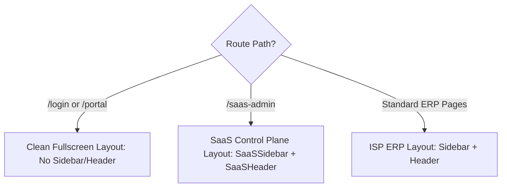

# Routing, Layouts & Route Protection

`IMPLEMENTED`

The Sheba ISP ERP frontend manages 28 operational routes with multi-layout switching, role-based guard wrappers, and responsive sidebar navigation.

---

## 1. Route Registry

| Route | Primary Component | Layout Type | Allowed Roles / Guard |
| :--- | :--- | :--- | :--- |
| `/` | `DashboardPage` | Standard ERP | `admin`, `super_admin` |
| `/login` | `LoginPage` | Fullscreen Clean | Public / Unauthenticated |
| `/customers` | `CustomersPage` | Standard ERP | `admin`, `billing`, `support`, `reseller` |
| `/packages` | `PackagesPage` | Standard ERP | `admin`, `billing` |
| `/billing` | `BillingPage` | Standard ERP | `admin`, `billing` |
| `/payments` | `PaymentsPage` | Standard ERP | `admin`, `billing`, `reseller` |
| `/network` | `NetworkPage` | Standard ERP | `admin`, `technician` |
| `/routers` | `RoutersPage` | Standard ERP | `admin`, `technician` |
| `/olt` | `OLTPage` | Standard ERP | `admin`, `technician` |
| `/online-sessions` | `OnlineSessionsPage` | Standard ERP | `admin`, `technician`, `support` |
| `/bandwidth` | `BandwidthPage` | Standard ERP | `admin`, `technician` |
| `/topology` | `TopologyPage` | Standard ERP | `admin`, `technician` |
| `/support` | `SupportPage` | Standard ERP | `admin`, `support`, `technician` |
| `/reports` | `ReportsPage` | Standard ERP | `admin`, `billing` |
| `/inventory` | `InventoryPage` | Standard ERP | `admin`, `technician` |
| `/hr` | `HRPage` | Standard ERP | `admin`, `hr` |
| `/callcenter` | `CallCenterPage` | Standard ERP | `admin`, `support`, `callcenter` |
| `/resellers` | `ResellersPage` | Standard ERP | `admin`, `reseller` |
| `/branches` | `BranchesPage` | Standard ERP | `admin` |
| `/staff` | `StaffPage` | Standard ERP | `admin` |
| `/tasks` | `TasksPage` | Standard ERP | `admin`, `technician` |
| `/wallet` | `WalletPage` | Standard ERP | `admin`, `billing`, `customer` |
| `/offers` | `OffersPage` | Standard ERP | `admin`, `sales` |
| `/notifications` | `NotificationsPage` | Standard ERP | All authenticated staff |
| `/configuration` | `ConfigurationPage` | Standard ERP | `super_admin`, `admin` |
| `/settings` | `SettingsPage` | Standard ERP | All authenticated staff |
| `/portal` | `PortalPage` | Standalone Customer | `customer` (Subscribers) |
| `/saas-admin` | `SaaSAdminPage` | SaaS Control Plane | `super_admin` only |

---

## 2. Layout Architectures

Layout switching is handled centrally by `src/components/layouts/AppShell.tsx`:



### Layout Breakdown:
1. **Standard ISP Layout (`Sidebar` + `Header`)**:
   - **`Sidebar.tsx`**: Collapsible 260px navigation pane categorized into functional modules (*Core*, *Network Operations*, *Management*, *Billing*, *Support*). Displays the active route with subtle primary accents and Lucide icons.
   - **`Header.tsx`**: Top navigation bar featuring the global search bar, active tenant indicator badge (`shebafi`), quick action shortcuts, notification bell with unread counter, theme toggle, and current user avatar dropdown.
2. **SaaS Control Plane Layout (`SaaSSidebar` + `SaaSHeader`)**:
   - Dedicated management view for superadmins to oversee tenant provisioning, global subscription billing, plan quotas, and multi-tenant telemetry.
3. **Clean Standalone Layout**:
   - Used for `/login` and `/portal` (Subscriber Self-Service) where staff navigation bars must be hidden.

---

## 3. Role-Based Route Protection (`RoleGuard`)

Role security in the UI is implemented via `src/components/auth/RoleGuard.tsx`:

```tsx
<RoleGuard allowedRoles={["admin", "super_admin", "billing"]} roleTitle="Billing Manager">
  <BillingContent />
</RoleGuard>
```

### Authorization Logic:
1. Reads the current role from `localStorage.getItem("sheba_user_role")`.
2. Automatically grants access to `super_admin` and `admin`.
3. Checks if the user's role is included in the page's `allowedRoles` array.
4. **If Authorized**: Renders `children`.
5. **If Denied**: Displays a structured access denied card with:
   - Warning icon (`ShieldAlert`)
   - The user's current role and the required role title
   - A button redirecting to the user's assigned default dashboard (based on `ROLE_DASHBOARD_MAP`).

```text
ROLE_DASHBOARD_MAP:
├── admin / super_admin       --> /
├── billing / billing_operator --> /dashboards/billing
├── sales / demo              --> /dashboards/sales
├── technician / line_man     --> /dashboards/technician
├── staff / support_staff     --> /dashboards/staff
├── reseller / reseller_l1    --> /dashboards/reseller-l1
├── customer                  --> /portal
```

> [!IMPORTANT]
> **Client-side guards provide UX convenience** by preventing accidental clicks on unauthorized screens. **Backend DRF permission classes (`IsAuthenticated`, `HasTenantPermission`) remain the authoritative security barrier.**
