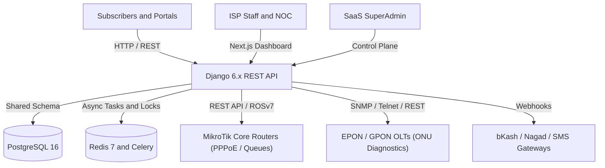

# Sheba ISP ERP Developer Documentation

Welcome to the canonical developer documentation for **Sheba ISP ERP** (`Taraldinn/sheba-erp`). This technical knowledge base serves as the authoritative source of truth for software engineers, network architects, and system operators building, maintaining, and deploying the platform.

---

## 1. What is Sheba ISP ERP?

Sheba ISP ERP is a mission-critical, high-concurrency Enterprise Resource Planning and Network Automation platform engineered specifically for Internet Service Providers (ISPs), Wireless ISPs (WISPs), fiber operators, and telecommunications carriers.

The platform unifies subscriber lifecycle management, RouterOS v7 MikroTik core routing automation, EPON/GPON OLT chassis management, double-entry financial ledger accounting, automated recurring billing, bKash/Nagad mobile financial services (MFS) webhook processing, field technician ticket dispatch, and a centralized SaaS multi-tenant control plane.

---

## 2. Core Architectural Invariants

Every modification to this codebase must adhere to the **Five Fundamental Invariants**:

1. **Shared Database, Shared Schema Multi-Tenancy**:
   - Exactly **one** PostgreSQL database with **one** schema (`public`).
   - Tenant isolation is strictly enforced at the application data layer via mandatory `tenant_id` foreign keys and `TenantScopedManager`.
2. **Server-Derived Multi-Tenancy**:
   - The active tenant is resolved strictly from the HTTP Host header (`HTTP Host -> TenantDomain -> Tenant -> request.tenant`).
   - Clients cannot spoof, switch, or declare tenant identity via headers (`X-Tenant-ID`), query parameters (`?tenant_id=`), or request bodies.
3. **Ledger as the Single Financial Source of Truth**:
   - Denormalized balances and expiry dates are cached projections.
   - The append-only, immutable `LedgerEntry` journal is the sole authoritative record of financial truth. Deletion is forbidden; corrections require explicit `Adjustment` records.
4. **Service-Mediated Network Operations**:
   - All router commands, traffic telemetry, and provisioning tasks pass through backend network service layers (`apps.network.services.mikrotik`).
   - Direct browser-to-router connections are strictly prohibited.
5. **Asynchronous Non-Blocking Execution**:
   - Router polling, webhook mutations, SMS broadcasts, and bulk expirations run on Celery background workers.
   - HTTP request threads must never block on external network I/O.

---

## 3. Technology Stack

| Tier | Technology | Purpose |
| :--- | :--- | :--- |
| **Backend Framework** | Django 6.1 / DRF 3.18 | Core REST API, ORM, multi-tenancy middleware, auth |
| **Database** | PostgreSQL 16 | Relational store, ACID transactions, row-level locks |
| **Worker & Cache** | Celery 5.3+ / Redis 7 | Distributed job execution, rate limiting, distributed locking |
| **Frontend Framework** | Next.js 16.3.4 (App Router) | Reactive web UI, SSR, Turbopack, App Shell |
| **Frontend UI/UX** | React 19, TailwindCSS v4 | Atomic styling, Radix UI primitives, Lucide icons |
| **Network Engine** | MikroTik RouterOS v7 | PPPoE servers, simple queues, active tunnel management |
| **Optical Engine** | EPON / GPON OLT Client | Chassis diagnostics, optical power (RX/TX dBm), ONU reboot |
| **API Schema** | drf-spectacular / OpenAPI 3.0 | Automated OpenAPI 3.0 contract generation |

---

## 4. Documentation Status Markers

Throughout this documentation, sections and features are tagged with standardized implementation markers:

- `IMPLEMENTED`: Verified active in current production codebase with comprehensive tests.
- `PARTIAL`: Core models or endpoints exist; UI integration or edge-case handling is in progress.
- `PLANNED`: Documented design or architectural target not yet merged into the codebase.
- `DEPRECATED`: Legacy implementation slated for retirement or already superseded.
- `NEEDS VERIFICATION`: Ambiguous implementation requiring live verification against hardware/network.

---

## 5. Documentation Map

<Cards>
  <Card title="Getting Started" href="/docs/getting-started/local-development" description="Setup your local environment, install dependencies, run migrations and seeds." />
  <Card title="Architecture" href="/docs/architecture/overview" description="Deep dive into multi-tenancy, modular monolith structure, and Celery pipeline." />
  <Card title="Business Domains" href="/docs/business-domains/customer-lifecycle" description="Complete lifecycle workflows for subscriptions, billing, recharges, and provisioning." />
  <Card title="Backend Modules" href="/docs/backend/overview" description="In-depth technical reference for all 13 Django apps and 52 database models." />
  <Card title="Frontend Architecture" href="/docs/frontend/overview" description="Next.js App Router layout, 29 page routes, UI design system, and ApiClient." />
  <Card title="MikroTik & Networking" href="/docs/networking/mikrotik-integration" description="RouterOS v7 integration, PPPoE secret sync, bandwidth queues, and OLT diagnostics." />
  <Card title="API Reference" href="/docs/api/endpoints" description="Complete REST API catalog, authentication headers, and webhook specifications." />
  <Card title="Operations & Runbooks" href="/docs/operations/runbooks" description="Deployment, database migration, automated backups, and incident troubleshooting." />
</Cards>
