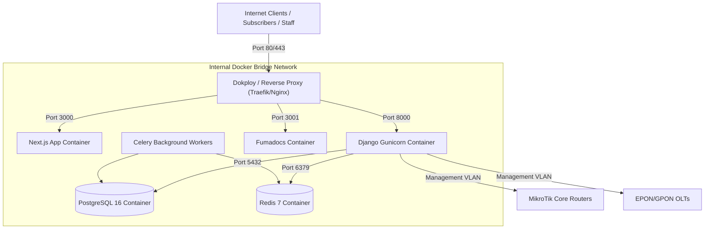

# Infrastructure Architecture Overview

`IMPLEMENTED`

Sheba ISP ERP is designed for deployment on bare-metal dedicated servers or high-performance Cloud VPS instances (e.g. Hetzner, DigitalOcean) running Linux Debian 12 / Ubuntu 24.04.

---

## 1. Core Services

- **Backend Web Server**: `gunicorn` with `uvloop` workers behind WhiteNoise compressed static asset serving.
- **Frontend Server**: Node.js Next.js standalone runner.
- **Relational Storage**: PostgreSQL 16 Alpine container with persistent named volumes (`postgres_data`).
- **Worker Queue**: Redis 7 Alpine with persistent append-only file (`redis_data`).
