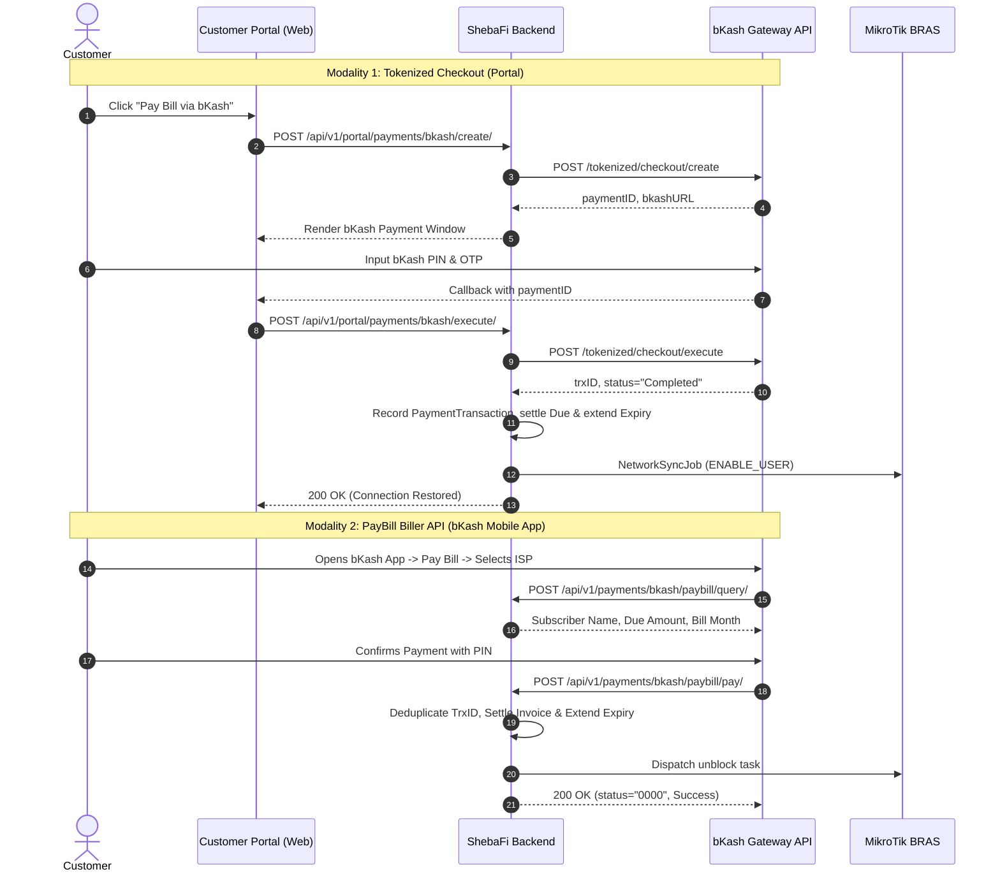

# bKash Tokenized Checkout & PayBill Integration

`IMPLEMENTED`

Official Reference: [bKash Developer Documentation](https://developer.bka.sh/docs/product-overview)

ShebaFi ISP provides native, multi-tenant integration with two official bKash products:
1. **bKash Tokenized Checkout (v1.2.0-beta)**: Embedded web checkout inside the Customer Self-Care Portal for online invoice settlement and instant subscription renewals.
2. **bKash PayBill Biller API**: Server-to-server utility billing allowing broadband subscribers to pay their monthly ISP bills directly inside the native **bKash Mobile App** under **Pay Bill > Internet**.

---

## Architecture Overview



---

## 1. bKash Tokenized Checkout

### Base URLs
- **Sandbox Environment**: `https://tokenized.sandbox.bka.sh/v1.2.0-beta`
- **Production Environment**: `https://tokenized.pay.bka.sh/v1.2.0-beta`

### Step 1: Grant Token
ShebaFi automatically manages token acquisition and caches the bearer token in Redis for 3,500 seconds (tokens are valid for 1 hour).
- **Endpoint**: `POST /tokenized/checkout/token/grant`
- **Headers**:
  - `username`: Merchant API Username
  - `password`: Merchant API Password
- **Body**:
  ```json
  {
    "app_key": "YOUR_APP_KEY",
    "app_secret": "YOUR_APP_SECRET"
  }
  ```

### Step 2: Create Payment Session
Initiated by the customer portal when renewing a subscription or paying an outstanding bill:
- **Internal Portal Endpoint**: `POST /api/v1/portal/payments/bkash/create/`
- **Outgoing bKash Call**: `POST /tokenized/checkout/create`
- **Payload**:
  ```json
  {
    "mode": "0011",
    "payerReference": "CUST-1001",
    "callbackURL": "https://isp.shebafi.net/portal",
    "amount": "800.00",
    "currency": "BDT",
    "intent": "sale",
    "merchantInvoiceNumber": "INV-2026-09-001"
  }
  ```
- **Response**:
  ```json
  {
    "statusCode": "0000",
    "statusMessage": "Successful",
    "paymentID": "TR0011241098877",
    "bkashURL": "https://tokenized.sandbox.bka.sh/checkout/...",
    "amount": "800.00"
  }
  ```

### Step 3: Execute Payment
Called when the customer authorizes the transaction:
- **Internal Portal Endpoint**: `POST /api/v1/portal/payments/bkash/execute/`
- **Outgoing bKash Call**: `POST /tokenized/checkout/execute`
- **Payload**:
  ```json
  {
    "paymentID": "TR0011241098877"
  }
  ```
- **Execution Effect**:
  - Validates `trxID` uniqueness.
  - Generates immutable `PaymentTransaction` record.
  - Updates `BillingAccount` and records double-entry `LedgerEntry`.
  - Reconciles unpaid invoices using FIFO allocation.
  - Extends `Customer.expiry_date` by the package duration (default 30 days).
  - Enqueues `NetworkSyncJob` to unblock / enable the subscriber's PPPoE/Static profile on MikroTik.

---

## 2. bKash PayBill Biller API

The bKash PayBill protocol allows ISP tenants to list their service inside the bKash consumer app.

### Query Subscriber Bill
bKash calls this endpoint when a subscriber enters their Customer Code, PPPoE username, or mobile number into the bKash App:
- **Endpoint**: `POST /api/v1/payments/bkash/paybill/query/`
- **Request Headers**: `Host: tenant.shebafi.net`
- **Request Body**:
  ```json
  {
    "account_no": "CUST-1001"
  }
  ```
- **Response**:
  ```json
  {
    "status": "0000",
    "message": "Success",
    "account_no": "CUST-1001",
    "customer_name": "Kamrul Hasan",
    "bill_month": "September 2026",
    "amount_due": "800.00",
    "min_amount": "10.00",
    "max_amount": "50000.00",
    "currency": "BDT"
  }
  ```

### Pay / Settle Bill
bKash calls this endpoint immediately after the subscriber enters their bKash PIN:
- **Endpoint**: `POST /api/v1/payments/bkash/paybill/pay/`
- **Request Body**:
  ```json
  {
    "account_no": "CUST-1001",
    "amount": "800.00",
    "trx_id": "BKA99887711",
    "payment_time": "2026-09-09T16:00:00+06:00"
  }
  ```
- **Response**:
  ```json
  {
    "status": "0000",
    "message": "Bill payment processed successfully",
    "trx_id": "BKA99887711",
    "account_no": "CUST-1001",
    "paid_amount": "800.00",
    "new_expiry": "2026-10-09"
  }
  ```

---

## 3. Multi-Tenant Gateway Configuration

Each tenant configures their own bKash Merchant credentials via `PaymentGateway`:
- `app_key`
- `app_secret`
- `username`
- `password`
- `is_sandbox` (Toggle between Sandbox and Live endpoints)
- `sandbox_app_key`, `sandbox_app_secret`, `sandbox_username`, `sandbox_password`

Credentials are encrypted in the database and never exposed in portal responses or API serializations.
