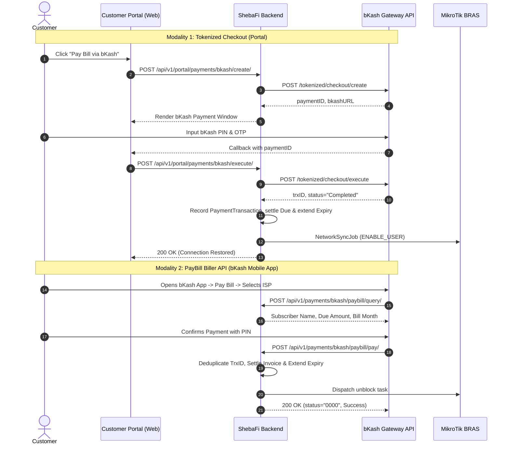
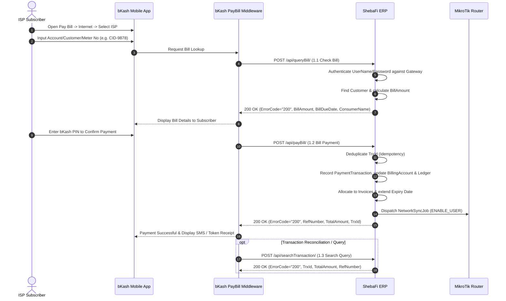

# bKash Tokenized Checkout & PayBill Integration

`IMPLEMENTED`

Official Reference: [bKash Developer Documentation](https://developer.bka.sh/docs/product-overview)

ShebaFi ISP provides native, multi-tenant integration with two official bKash products:
1. **bKash Tokenized Checkout (v1.2.0-beta)**: Embedded web checkout inside the Customer Self-Care Portal for online invoice settlement and instant subscription renewals.
2. **bKash PayBill Biller API**: Server-to-server utility billing allowing broadband subscribers to pay their monthly ISP bills directly inside the native **bKash Mobile App** under **Pay Bill > Internet**.

---

## Architecture Overview



---

## 1. bKash Tokenized Checkout

### Base URLs
- **Sandbox Environment**: `https://tokenized.sandbox.bka.sh/v1.2.0-beta`
- **Production Environment**: `https://tokenized.pay.bka.sh/v1.2.0-beta`

### Step 1: Grant Token
ShebaFi automatically manages token acquisition and caches the bearer token in Redis for 3,500 seconds (tokens are valid for 1 hour).
- **Endpoint**: `POST /tokenized/checkout/token/grant`
- **Headers**:
  - `username`: Merchant API Username
  - `password`: Merchant API Password
- **Body**:
  ```json
  {
    "app_key": "YOUR_APP_KEY",
    "app_secret": "YOUR_APP_SECRET"
  }
  ```

### Step 2: Create Payment Session
Initiated by the customer portal when renewing a subscription or paying an outstanding bill:
- **Internal Portal Endpoint**: `POST /api/v1/portal/payments/bkash/create/`
- **Outgoing bKash Call**: `POST /tokenized/checkout/create`
- **Payload**:
  ```json
  {
    "mode": "0011",
    "payerReference": "CUST-1001",
    "callbackURL": "https://isp.shebafi.net/portal",
    "amount": "800.00",
    "currency": "BDT",
    "intent": "sale",
    "merchantInvoiceNumber": "INV-2026-09-001"
  }
  ```
- **Response**:
  ```json
  {
    "statusCode": "0000",
    "statusMessage": "Successful",
    "paymentID": "TR0011241098877",
    "bkashURL": "https://tokenized.sandbox.bka.sh/checkout/...",
    "amount": "800.00"
  }
  ```

### Step 3: Execute Payment
Called when the customer authorizes the transaction:
- **Internal Portal Endpoint**: `POST /api/v1/portal/payments/bkash/execute/`
- **Outgoing bKash Call**: `POST /tokenized/checkout/execute`
- **Payload**:
  ```json
  {
    "paymentID": "TR0011241098877"
  }
  ```
- **Execution Effect**:
  - Validates `trxID` uniqueness.
  - Generates immutable `PaymentTransaction` record.
  - Updates `BillingAccount` and records double-entry `LedgerEntry`.
  - Reconciles unpaid invoices using FIFO allocation.
  - Extends `Customer.expiry_date` by the package duration (default 30 days).
  - Enqueues `NetworkSyncJob` to unblock / enable the subscriber's PPPoE/Static profile on MikroTik.

---

## 2. bKash PayBill Biller API (Outbound Interface v1.4)

Official Reference: **bKash API for Bill Payment Outbound Interface - Partner Integration Guide (Document version 1.4, Published January 30, 2024)**

The bKash PayBill Outbound Interface allows bKash Pay Bill middleware to communicate directly with ShebaFi ERP to validate subscriber accounts, settle bill payments, and query transaction outcomes.

### Architecture & Call Flow



---

### Endpoint Routing & Supported URL Paths

ShebaFi supports both the official sample endpoints specified in the bKash guide and canonical RESTful aliases:

| Interface | bKash Documented URL | Canonical ShebaFi Route | HTTP Method |
|---|---|---|---|
| **Check Bill** | `/api/queryBill/` | `/api/v1/payments/bkash/paybill/query/` | POST |
| **Bill Payment** | `/api/payBill/` | `/api/v1/payments/bkash/paybill/pay/` | POST |
| **Transaction Search** | `/api/searchTransaction/` | `/api/v1/payments/bkash/paybill/search/` | POST |

Payloads can be sent via `multipart/form-data` (using `-F` flags as shown in bKash cURL samples), `application/x-www-form-urlencoded`, or `application/json`.

---

### 2.1 Check Bill (`1.1 Check Bill`)

Invoked by bKash Pay Bill middleware to validate the subscriber and fetch outstanding dues.

#### Request Parameters

| Parameter | Type | Required | Description | Example |
|---|---|---|---|---|
| `UserName` | String | Mandatory | Partner login identifier configured in `PaymentGateway` | `bKash` |
| `Password` | String | Mandatory | Partner password associated with `UserName` | `K38MO3` |
| `CustomerNo` | String | Mandatory | Reference identifier. Aliases accepted: `AccNo`, `MeterNo`, `CustomerNo`, `BillNo`, `RefID`, `account_no`, `subscriber_id` | `CID-9878` |
| `BillMonth` | String | Optional | Billing month in format `MMYYYY` | `022018` |
| `Amount` | String | Optional | Bill Amount (if applicable) | `520` |

#### Response Parameters

| Parameter | Type | Required | Description | Example |
|---|---|---|---|---|
| `ErrorCode` | String | Mandatory | Result code after processing request. `"200"` indicates success | `200` |
| `ErrorMsg` | String | Mandatory | Status description after bill check | `Successful` |
| `ConsumerName` | String | Optional | Full name of subscriber | `Amena Khatun` |
| `BillMonth` | String | Optional | Billing month (`MMYYYY`) | `072018` |
| `BillAmount` | String | Mandatory | Total amount payable | `540.00` |
| `BillDueDate(YYYYMMDD)` | String | Optional | Last date of payment | `20260930` |
| `QueryTime` | String | Mandatory | Middleware query timestamp (`YYYYMMDDHHmmss`) | `20260917123000` |
| `Amount Breakdown(if available)` | String | Optional | Itemized cost description | `{Package Cost: 540.00}` |

#### cURL Sample

```bash
curl -L -X POST 'https://isp.shebafi.net/api/queryBill/' \
  -F 'UserName="bKash"' \
  -F 'Password="K38MO3"' \
  -F 'CustomerNo="CID-9878"' \
  -F 'BillMonth="092026"'
```

---

### 2.2 Bill Payment (`1.2 Bill Payment`)

Invoked by bKash Pay Bill middleware when a subscriber authorizes payment in the bKash App.

#### Request Parameters

| Parameter | Type | Required | Description | Example |
|---|---|---|---|---|
| `UserName` | String | Mandatory | Partner login identifier | `bKash` |
| `Password` | String | Mandatory | Partner login password | `K38MO3` |
| `CustomerNo` | String | Mandatory | Subscriber reference number (aliases accepted: `AccNo`, `MeterNo`, `BillNo`, `RefID`) | `CID-9878` |
| `BillMonth` | String | Optional | Billing month (`MMYYYY`) | `092026` |
| `Amount` | String | Mandatory | Payment amount | `540.00` |
| `UserMobileNumber`| String | Optional | Consumer mobile number | `017111928374` |
| `TrxId` | String | Mandatory | Unique bKash transaction identifier | `5C8300HJ6V` |
| `PayTime` | String | Optional | Payment timestamp from CPS | `20260917123000` |

#### Response Parameters

| Parameter | Type | Required | Description | Example |
|---|---|---|---|---|
| `ErrorCode` | String | Mandatory | Result code (`"200"` indicates success) | `200` |
| `ErrorMsg` | String | Mandatory | Result message | `Successful` |
| `ConsumerName` | String | Optional | Subscriber name | `Amena Khatun` |
| `TotalAmount` | String | Mandatory | Total amount paid | `540.00` |
| `TrxId` | String | Mandatory | Echoes bKash transaction ID | `5C8300HJ6V` |
| `MiddlewarePayTime`| String | Mandatory | Middleware processing time (`YYYYMMDDHHmmss`) | `20260917123000` |
| `RefNumber` | String | Optional | ShebaFi transaction ID reference | `550e8400-e29b-41d4-a716-446655440000` |
| `CustomMessage` | String | Optional | Contextual message or receipt token | `Account CID-9878 recharged successfully` |

#### Processing Behavior
1. **Idempotency**: Duplicate calls with the same `TrxId` return `ErrorCode: "200"` immediately without double-crediting balances or repeating ledger entries.
2. **Ledger & Accounting**: Records a double-entry `LedgerEntry` under the customer's `BillingAccount` and allocates funds to unpaid `Invoice` records.
3. **Line Restoration**: Automatically updates `Customer.status` to `ACTIVE`, advances `Customer.expiry_date`, and enqueues a background `NetworkSyncJob` to unblock/enable the subscriber on the connected MikroTik BRAS.

#### cURL Sample

```bash
curl -L -X POST 'https://isp.shebafi.net/api/payBill/' \
  -F 'UserName="bKash"' \
  -F 'Password="K38MO3"' \
  -F 'CustomerNo="CID-9878"' \
  -F 'Amount="540.00"' \
  -F 'TrxId="5C8300HJ6V"' \
  -F 'UserMobileNumber="017111928374"' \
  -F 'PayTime="20260917123000"'
```

---

### 2.3 Transaction Search Query (`1.3 Transaction Search Query`)

Invoked by bKash middleware to verify whether a specific transaction was successfully recorded in ShebaFi ERP.

#### Request Parameters

| Parameter | Type | Required | Description | Example |
|---|---|---|---|---|
| `UserName` | String | Mandatory | Partner login identifier | `bKash` |
| `Password` | String | Mandatory | Partner login password | `K38MO3` |
| `TrxId` | String | Mandatory | bKash transaction identifier to check | `5C8300HJ6V` |

#### Response Parameters

| Parameter | Type | Required | Description | Example |
|---|---|---|---|---|
| `ErrorCode` | String | Mandatory | `"200"` on success, `"404"` if transaction not found | `200` |
| `ErrorMsg` | String | Mandatory | Result status description | `Successful` |
| `TotalAmount` | String | Mandatory | Transaction amount | `540.00` |
| `TrxId` | String | Mandatory | bKash transaction ID | `5C8300HJ6V` |
| `MiddlewarePayTime`| String | Mandatory | Original transaction processing timestamp | `20260917123000` |
| `RefNumber` | String | Optional | Internal transaction ID | `550e8400-e29b-41d4-a716-446655440000` |
| `CustomMessage` | String | Optional | Customer information summary | `Customer: Amena Khatun (CID-9878)` |

#### cURL Sample

```bash
curl -L -X POST 'https://isp.shebafi.net/api/searchTransaction/' \
  -F 'UserName="bKash"' \
  -F 'Password="K38MO3"' \
  -F 'TrxId="5C8300HJ6V"'
```

---

### 2.4 Error Code Specification

In compliance with **Section 2 of the bKash Partner Integration Guide**, ShebaFi returns the following standardized error codes and descriptions:

| Code | Message | Description |
|---|---|---|
| `200` | `Successful` / `Success` | Transaction or query executed successfully |
| `403` | `Authentication failed` | `UserName` or `Password` invalid or unassigned to an active bKash gateway |
| `404` | `Data not found` | Requested subscriber account or transaction ID does not exist |
| `406` | `Mandatory Field missing` | Any mandatory parameter (`UserName`, `Password`, `CustomerNo`, `TrxId`, or `Amount`) is empty or omitted |
| `435` | `Data Mismatch` | Amount cannot be parsed or data format mismatch |
| `436` | `Already paid` | Subscriber has zero outstanding due and subscription is active |
| `438` | `Minimum amount not paid` | Payment amount is below minimum payment threshold (minimum 10.00 BDT) |

## 3. Multi-Tenant Gateway Configuration

Each tenant configures their own bKash Merchant credentials via `PaymentGateway`:
- `app_key`
- `app_secret`
- `username`
- `password`
- `is_sandbox` (Toggle between Sandbox and Live endpoints)
- `sandbox_app_key`, `sandbox_app_secret`, `sandbox_username`, `sandbox_password`

Credentials are encrypted in the database and never exposed in portal responses or API serializations.
