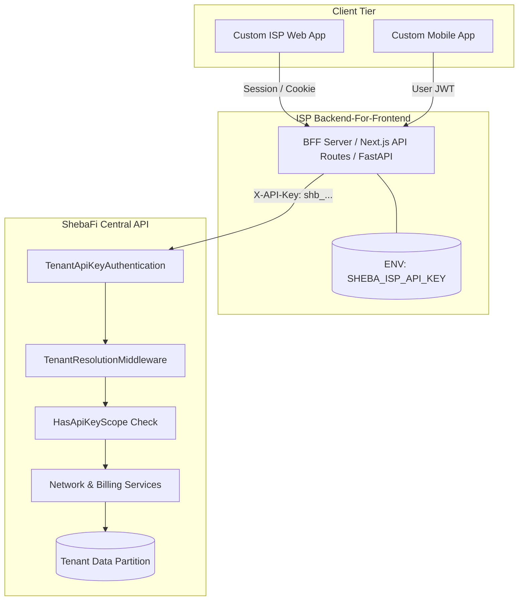

# Custom ISP Frontend & BFF Integration

`IMPLEMENTED`

Sheba ISP ERP enables individual ISPs to deploy custom, white-labeled client experiences (such as custom mobile apps, customer self-care portals, and billing automations) while preserving multi-tenant isolation, business logic, and security.

This is powered by **ISP Secret API Keys** managed exclusively by Super Admins through the Central SaaS Control Plane.

---

## 1. Architectural Model



---

## 2. Security Invariants

### 1. No Client-Side Key Exposure
Secret keys (`shb_...`) are high-privilege credentials. They must **never** be included in frontend bundles, GitHub repositories, or mobile applications. All calls using the secret key must go through a secure proxy server (BFF).

### 2. Cryptographic Salted Storage
The Central ERP never stores raw secret keys. Only a SHA-256 hash is kept in the database (`token_hash`). The key is displayed **only once** to the Super Admin at creation time.

### 3. Tenant Boundary Binding
Every API key is strictly bound to its assigned `Tenant`. The ERP automatically validates that all database operations, filters, and queries are restricted to that tenant's records. Attempting to access or alter another tenant's subscriber returns `404 Not Found`.

### 4. Control Plane Isolation
API keys cannot access SaaS platform administration endpoints (`/api/v1/saas/*`). Control plane access strictly requires Super Admin credentials.

---

## 3. Request Headers

| Header | Example | Description |
| :--- | :--- | :--- |
| `X-API-Key` | `shb_9xK8...` | Primary recommended API key header. |
| `Authorization` | `Api-Key shb_9xK8...` | Alternative standard Authorization header. |
| `Content-Type` | `application/json` | Required for POST/PUT/PATCH bodies. |

---

## 4. Permission Scopes

Credentials can be scoped down to specific functional modules:

- `customers:read` - Read customer records, statuses, and PPPoE usernames.
- `customers:write` - Create, edit, recharge, lock, or unlock customer accounts.
- `billing:read` - Read billing packages, prices, and speed tiers.
- `billing:write` - Manage packages and subscriber balances.
- `invoices:read` - Query subscriber invoice details and PDF exports.
- `payments:read` - Read payment transaction history and reconciliations.
- `payments:write` - Record manual collections or gateway settlements.
- `network:read` - Query MikroTik router stats and live session counts.
- `network:write` - Terminate PPPoE sessions or reset ONT bindings.
- `reports:read` - Read analytics and operational dashboards.
- `*` - Full access across all tenant-scoped resources.

---

## 5. Implementation Code Examples

### Next.js 14 / 15 Route Handler (BFF Pattern)

```typescript
// app/api/customers/route.ts
import { NextRequest, NextResponse } from 'next/server';

const ERP_API_URL = process.env.SHEBA_ERP_URL || 'https://api.shebafi.com/api/v1';
const ISP_SECRET = process.env.SHEBA_ISP_API_KEY!;

export async function GET(req: NextRequest) {
  const searchParams = req.nextUrl.searchParams;
  const res = await fetch(`${ERP_API_URL}/customers/?${searchParams.toString()}`, {
    headers: {
      'X-API-Key': ISP_SECRET,
      'Content-Type': 'application/json',
    },
    cache: 'no-store',
  });

  const data = await res.json();
  return NextResponse.json(data, { status: res.status });
}
```

### Python FastAPI BFF Proxy

```python
# bff_main.py
import os
import httpx
from fastapi import FastAPI, Request
from fastapi.responses import JSONResponse

app = FastAPI()
ERP_API_URL = os.getenv("SHEBA_ERP_URL", "https://api.shebafi.com/api/v1")
ISP_SECRET = os.environ["SHEBA_ISP_API_KEY"]

@app.get("/subscribers")
async def list_subscribers(request: Request):
    async with httpx.AsyncClient(base_url=ERP_API_URL) as client:
        resp = await client.get(
            "/customers/",
            params=dict(request.query_params),
            headers={"X-API-Key": ISP_SECRET},
        )
        return JSONResponse(content=resp.json(), status_code=resp.status_code)
```

---

## 6. Error Codes Reference

| Error Code | HTTP Status | Meaning |
| :--- | :--- | :--- |
| `INVALID_API_KEY` | 401 | The provided API key does not exist or has an invalid format. |
| `CREDENTIAL_REVOKED` | 401 | The API key was revoked by Super Admin and cannot be used. |
| `CREDENTIAL_EXPIRED` | 401 | The API key has passed its expiration timestamp. |
| `CREDENTIAL_SUSPENDED` | 401 | The API key is temporarily paused by Super Admin. |
| `PERMISSION_DENIED` | 403 | The API key lacks the required permission scope. |
