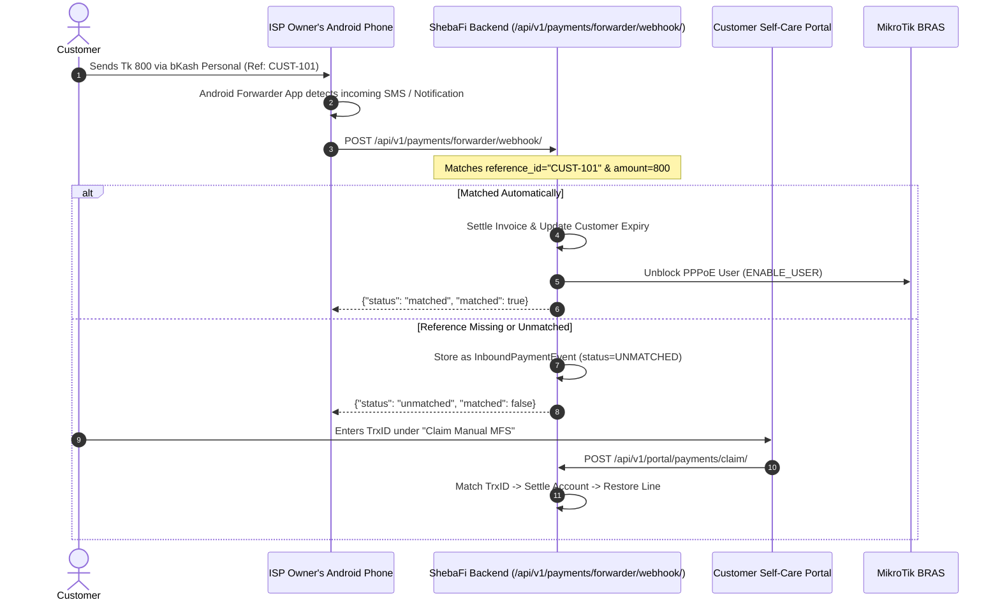

# Manual MFS & Android Forwarder App Integration

`IMPLEMENTED`

---

## 1. Problem Statement & Architecture

In Bangladesh, smaller neighborhood ISPs and local cable operators often operate without a registered corporate entity or official **bKash / Nagad Merchant Account**. Instead, their subscribers pay monthly broadband bills by doing a standard **Personal bKash "Send Money"** or **"Cash Out"** transaction directly to the ISP owner's personal SIM card.

Without an official merchant webhook, payments would typically require manual human verification of SMS messages.

### The ShebaFi Automated Solution
ShebaFi provides an automated **Inbound Payment Webhook** compatible with any generic Android SMS Forwarder application (such as *SMS Forwarder*, *MacroDroid*, or a lightweight custom APK) installed on the ISP owner's Android phone:



---

## 2. Inbound Forwarder Webhook Contract

### Endpoint
- **URL**: `POST /api/v1/payments/forwarder/webhook/`
- **Authentication**: Tenant resolved from `Host` header (e.g. `ispname.shebafi.net` or `alpha.localhost`).
- **Headers**:
  ```http
  Content-Type: application/json
  Host: alpha.shebafi.net
  ```

### Request Payload Specification
The Android app posts JSON with the following parameters:

| Field | Type | Required | Description |
| :--- | :--- | :--- | :--- |
| `sender_account` | `string` | Optional | The sender's mobile phone number (e.g. `01711223344`). |
| `reference_id` | `string` | Recommended | The reference entered by the customer in the bKash app (Customer Code or PPPoE username). |
| `amount` | `decimal` | Required | The transaction amount received (e.g. `800.00`). |
| `trx_id` | `string` | Required | The unique MFS transaction ID (e.g. `9H82JKS10A`). |
| `provider` | `string` | Optional | MFS provider name (`bKash`, `Nagad`, `Rocket`, etc.). Default: `bKash`. |

#### Example JSON Payload
```json
{
  "sender_account": "01711223344",
  "reference_id": "CUST-101",
  "amount": 800.00,
  "trx_id": "9H82JKS10A",
  "provider": "bKash"
}
```

---

## 3. Server Processing & Automated Matching

When ShebaFi receives this webhook, the server executes:

1. **Idempotency Verification**: If `trx_id` has already been credited, it returns HTTP 200 without double-crediting.
2. **Customer Matching**:
   - Matches `reference_id` against `Customer.customer_code` or `Customer.pppoe_username`.
   - If reference is missing or empty, matches `sender_account` against `Customer.mobile`.
3. **If Customer Matches**:
   - Generates a verified `PaymentTransaction` record.
   - Adjusts `Customer.due_amount` and `Customer.advance_amount`.
   - Extends subscription validity by the package duration.
   - Enqueues `NetworkSyncJob.Action.ENABLE_USER` to MikroTik router to immediately re-enable high-speed internet access.
   - Returns HTTP 200:
     ```json
     {
       "status": "matched",
       "matched": true,
       "customer_code": "CUST-101",
       "customer_name": "Kamrul Hasan",
       "amount": "800.00",
       "trx_id": "9H82JKS10A",
       "message": "Payment matched and customer line recharged successfully."
     }
     ```
4. **If Customer Cannot be Matched**:
   - Stores the raw notification in `InboundPaymentEvent` with status `UNMATCHED`.
   - Returns HTTP 202:
     ```json
     {
       "status": "unmatched",
       "matched": false,
       "event_id": "84c8fb23-92f7-4148-8df0-e3eb5a43b2f8",
       "message": "Payment recorded as unmatched. Waiting for customer claim or staff review."
     }
     ```

---

## 4. Customer Self-Care Claim Endpoint

If a subscriber forgot to enter their Customer Code as the bKash reference, their payment is stored as `UNMATCHED`. The customer simply enters their TrxID in the Customer Portal under **"Claim Manual MFS"**:

- **Endpoint**: `POST /api/v1/portal/payments/claim/`
- **Headers**: `Authorization: Bearer <CUSTOMER_PORTAL_JWT>`
- **Payload**:
  ```json
  {
    "trx_id": "9H82JKS10A"
  }
  ```
- **Response**:
  ```json
  {
    "success": true,
    "message": "Payment of ৳800.00 successfully claimed and credited to your account.",
    "trx_id": "9H82JKS10A",
    "amount": "800.00",
    "new_expiry": "2026-10-09"
  }
  ```

---

## 5. Android Forwarder Implementation Example

### cURL Test Command
```bash
curl -X POST https://alpha.shebafi.net/api/v1/payments/forwarder/webhook/ \
  -H "Content-Type: application/json" \
  -d '{
    "sender_account": "01711223344",
    "reference_id": "CUST-101",
    "amount": 800.00,
    "trx_id": "BKA99882211",
    "provider": "bKash"
  }'
```

### Kotlin / Android Background Worker Snippet
```kotlin
fun dispatchPaymentToSheba(context: Context, sender: String, ref: String, amount: Double, trxId: String) {
    val json = JSONObject().apply {
        put("sender_account", sender)
        put("reference_id", ref)
        put("amount", amount)
        put("trx_id", trxId)
        put("provider", "bKash")
    }

    val request = Request.Builder()
        .url("https://isp.shebafi.net/api/v1/payments/forwarder/webhook/")
        .post(json.toString().toRequestBody("application/json".toMediaType()))
        .build()

    OkHttpClient().newCall(request).enqueue(object : Callback {
        override fun onFailure(call: Call, e: IOException) {
            Log.e("Forwarder", "Failed to dispatch payment: ${e.message}")
        }
        override fun onResponse(call: Call, response: Response) {
            Log.i("Forwarder", "Sheba response: ${response.body?.string()}")
        }
    })
}
```
