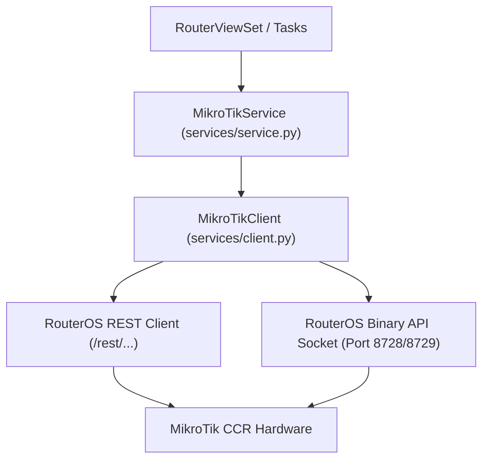

# MikroTik RouterOS v7 Integration

`IMPLEMENTED`

The MikroTik integration engine is located in `backend/apps/network/services/mikrotik/`.

---

## 1. Adapter Architecture

### Key Components:
- `client.py`: Low-level network adapter managing TCP sockets, SSL handshakes, and REST HTTP session pooling.
- `service.py`: High-level business operations (`create_pppoe_user`, `disable_pppoe_user`, `sync_sessions`, `get_traffic`).
- `pppoe.py`: Helper logic for formatting PPPoE secret payloads and profile parameters.
- `system.py`: Resource telemetry polling (`/system/resource/print`).

---

## 2. Supported Hardware Operations

1. **PPPoE Secret Management**:
   - `create_pppoe_user(username, password, profile, remote_address)`
   - `disable_pppoe_user(username)`: Sets `disabled=yes`.
   - `enable_pppoe_user(username)`: Sets `disabled=no`.
   - `remove_pppoe_user(username)`: Deletes secret upon subscriber termination.
2. **Active Tunnel Management**:
   - `get_active_sessions()`: Lists all connected subscribers with IP and uptime.
   - `kick_active_session(username)`: Forcibly terminates tunnel in `/ppp/active/remove`.
3. **Telemetry & Diagnostics**:
   - `get_system_health()`: Reads CPU load, available RAM, voltage, temperature, and RouterOS version.
   - `get_interface_traffic(interface)`: Real-time RX/TX bit rate monitoring.
