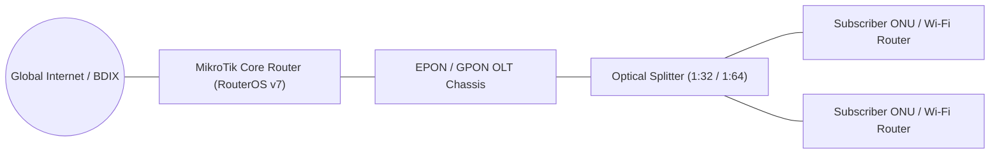

# ISP Network Model Overview

`IMPLEMENTED`

Sheba ISP ERP manages physical carrier hardware spanning upstream core routers, optical distribution frames (ODFs), optical line terminals (OLTs), and subscriber optical network units (ONUs).

---

## 1. Physical Hardware Supported

- **Edge / BNG Routers**: MikroTik CCR series (CCR1036, CCR2004, CCR2116, CCR2216) running RouterOS v7.
- **Optical Aggregation**: VSOL, Huawei, ZTE, BDCOM EPON & GPON chassis.
- **Client CPEs**: Bridged ONUs with PPPoE dialer termination on subscriber Wi-Fi routers.

---

## 2. Invariant: Service-Mediated Hardware Operations

Direct browser-to-hardware communication is strictly forbidden. All provisioning commands, optical diagnostics, and telemetry queries are executed by server-side adapter services in `apps.network.services`.
