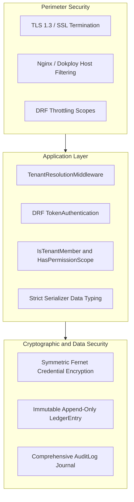

# Security Architecture Overview

`IMPLEMENTED`

Sheba ISP ERP implements a multi-layered defense-in-depth model protecting subscriber personal identifiable information (PII), double-entry financial journals, and ISP core network infrastructure.

---

## 1. Security Boundaries

- **Public Internet vs Staff**: Only `/api/v1/auth/login/`, `/api/v1/customer/query/`, and `/api/v1/payments/sms/webhook/` are accessible unauthenticated.
- **Tenant Boundaries**: A user authenticated under Tenant A cannot view or alter data under Tenant B, even with a valid staff token.
- **Hardware Isolation**: MikroTik routers and OLTs are placed on dedicated management VLANs, accessible only from the ERP backend server IP.
