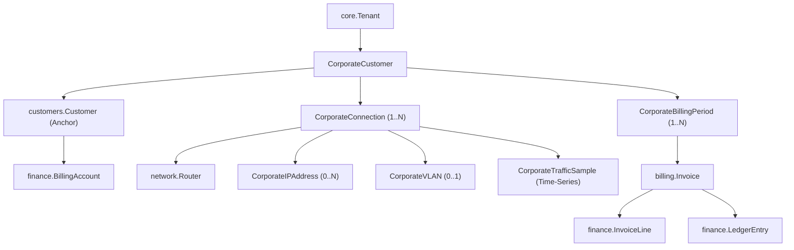

# Design Specification: Stage 11 — Corporate / Enterprise ISP Management

## 1. Overview & Business Requirements

Sheba ISP ERP requires dedicated enterprise-grade capabilities for corporate broadband subscribers. Unlike residential subscribers who purchase fixed-speed prepaid PPPoE packages, corporate clients require:
- Complex multi-branch organizational profiles with tax/legal credentials (BIN/TIN, Trade License).
- Multiple physical or logical connections (leased line circuits, metro ethernet, VLAN trunks) under a single master billing account.
- Tenant-isolated dedicated IPv4 address pools and IP lease tracking.
- Dedicated VLAN assignments (802.1Q tags 1–4094) bound to router interfaces.
- High-resolution MRTG/time-series traffic telemetry collected every 5 minutes.
- Multi-connection bandwidth aggregation per customer.
- Deterministic 95th-percentile (p95) bandwidth calculation engine.
- Automated corporate billing generating itemized `InvoiceLine`s on the existing `Invoice` system, with all financial entries committed to the immutable append-only `LedgerEntry` journal.
- Full capability-based RBAC, external API client scopes, and an integrated ISP Admin frontend.

---

## 2. Architecture & Invariants

This design strictly adheres to all five Sheba ISP ERP core invariants:
1. **Shared Database, Shared Schema**: All corporate tables reside in the single `public` schema and enforce mandatory foreign keys to `core.Tenant`.
2. **Server-Derived Multi-Tenancy**: All corporate requests resolve tenant identity strictly via `request.tenant` derived from the HTTP Host header. Client-supplied tenant parameters are rejected.
3. **Ledger as Financial Truth**: No separate corporate ledger. Corporate invoices generate standard `billing.Invoice` records, itemized `finance.InvoiceLine`s, and append-only `finance.LedgerEntry` records.
4. **Service-Mediated Hardware Access**: Device interaction (MikroTik traffic monitoring, VLAN creation) passes exclusively through backend service abstractions (`apps/network/services/mikrotik/`) outside DB transactions.
5. **Asynchronous Execution**: Telemetry polling and heavy 95th percentile aggregations run asynchronously in Celery workers protected by Redis distributed locks.

---

## 3. Data Model Design (`apps/corporate/models.py`)

A new modular application `apps/corporate/` will house the corporate domain models, registered in `INSTALLED_APPS`.



### 3.1 `CorporateCustomer`
The enterprise account model, anchored to `customers.Customer` for financial unification.
- `id` (UUID, PK)
- `tenant` (FK `core.Tenant`, on_delete=CASCADE)
- `customer` (OneToOneField `customers.Customer`, on_delete=CASCADE, related_name='corporate_profile')
- `company_name` (CharField 200, db_index=True)
- `legal_name` (CharField 200, blank=True)
- `trade_license_no` (CharField 100, blank=True)
- `bin_tin` (CharField 50, blank=True)
- `contact_person` (CharField 150)
- `billing_contact_email` (EmailField)
- `billing_contact_phone` (CharField 50)
- `committed_bandwidth_mbps` (PositiveIntegerField, default=100)
- `burst_rate_per_mbps` (DecimalField max_digits=10, decimal_places=2, default=500.00)
- `base_monthly_fee` (DecimalField max_digits=12, decimal_places=2, default=15000.00)
- `billing_cycle` (CharField, choices `['CALENDAR_MONTH', 'ANNIVERSARY']`, default='CALENDAR_MONTH')
- `credit_terms_days` (PositiveIntegerField, default=30)
- `aggregation_policy` (CharField, choices `['AGGREGATE_SUM', 'PER_CIRCUIT']`, default='AGGREGATE_SUM')
- `status` (CharField, choices `['ACTIVE', 'SUSPENDED', 'TERMINATED']`, default='ACTIVE')
- `notes` (TextField, blank=True)
- `created_at`, `updated_at` (DateTimeField)
- **Constraint**: `models.UniqueConstraint(fields=['tenant', 'company_name'], name='unique_tenant_corporate_company')`

### 3.2 `CorporateConnection`
Represents an individual physical or logical circuit connecting a branch office or data center.
- `id` (UUID, PK)
- `tenant` (FK `core.Tenant`, on_delete=CASCADE)
- `corporate_customer` (FK `CorporateCustomer`, on_delete=CASCADE, related_name='connections')
- `circuit_id` (CharField 100, db_index=True)
- `name` (CharField 150, help_text="e.g. Head Office Primary Leased Line")
- `service_location` (CharField 255)
- `connection_type` (CharField, choices `['LEASED_LINE', 'METRO_ETHERNET', 'VLAN_TRUNK', 'PPPOE_ENTERPRISE', 'STATIC_ROUTED']`, default='LEASED_LINE')
- `router` (FK `network.Router`, on_delete=SET_NULL, null=True, blank=True, related_name='corporate_connections')
- `interface_name` (CharField 100, help_text="RouterOS interface name, e.g. sfp-sfpplus1, ether3")
- `committed_bandwidth_mbps` (PositiveIntegerField, default=50)
- `burst_bandwidth_cap_mbps` (PositiveIntegerField, default=100)
- `status` (CharField, choices `['PENDING', 'ACTIVE', 'SUSPENDED', 'DISCONNECTED']`, default='ACTIVE')
- `activation_date` (DateField, null=True, blank=True)
- `termination_date` (DateField, null=True, blank=True)
- `metadata` (JSONField, default=dict, blank=True)
- `created_at`, `updated_at` (DateTimeField)
- **Constraint**: `models.UniqueConstraint(fields=['tenant', 'circuit_id'], name='unique_tenant_corporate_circuit_id')`

### 3.3 `CorporateIPPool` & `CorporateIPAddress`
Tenant-scoped dedicated IP address management.
- `CorporateIPPool`:
  - `id` (UUID, PK)
  - `tenant` (FK `core.Tenant`)
  - `name` (CharField 150)
  - `network_cidr` (CharField 50, e.g. '103.145.10.0/24')
  - `gateway` (GenericIPAddressField)
  - `dns_primary` (GenericIPAddressField, default='8.8.8.8')
  - `dns_secondary` (GenericIPAddressField, default='1.1.1.1')
  - `is_active` (BooleanField, default=True)
  - `created_at`, `updated_at` (DateTimeField)
  - **Constraint**: `models.UniqueConstraint(fields=['tenant', 'network_cidr'], name='unique_tenant_ip_pool_cidr')`
- `CorporateIPAddress`:
  - `id` (UUID, PK)
  - `tenant` (FK `core.Tenant`)
  - `pool` (FK `CorporateIPPool`, on_delete=CASCADE, related_name='addresses')
  - `ip_address` (GenericIPAddressField)
  - `connection` (FK `CorporateConnection`, on_delete=SET_NULL, null=True, blank=True, related_name='dedicated_ips')
  - `status` (CharField, choices `['AVAILABLE', 'ALLOCATED', 'RESERVED']`, default='AVAILABLE')
  - `allocated_at` (DateTimeField, null=True, blank=True)
  - `released_at` (DateTimeField, null=True, blank=True)
  - `notes` (CharField 255, blank=True)
  - **Constraint**: `models.UniqueConstraint(fields=['tenant', 'ip_address'], name='unique_tenant_corporate_ip')`

### 3.4 `CorporateVLAN`
Carrier VLAN assignment management.
- `id` (UUID, PK)
- `tenant` (FK `core.Tenant`)
- `vlan_id` (PositiveIntegerField, 1–4094)
- `name` (CharField 100)
- `router` (FK `network.Router`, on_delete=CASCADE, related_name='corporate_vlans')
- `interface_name` (CharField 100, default='ether1')
- `connection` (OneToOneField `CorporateConnection`, on_delete=SET_NULL, null=True, blank=True, related_name='vlan_assignment')
- `description` (CharField 255, blank=True)
- `created_at` (DateTimeField, auto_now_add=True)
- **Constraint**: `models.UniqueConstraint(fields=['tenant', 'router', 'vlan_id'], name='unique_tenant_router_vlan')`

### 3.5 `CorporateTrafficSample`
High-resolution time-series telemetry storage for bandwidth calculations.
- `id` (UUID, PK)
- `tenant` (FK `core.Tenant`)
- `connection` (FK `CorporateConnection`, on_delete=CASCADE, related_name='traffic_samples')
- `timestamp` (DateTimeField, db_index=True)
- `inbound_bps` (BigIntegerField, default=0)
- `outbound_bps` (BigIntegerField, default=0)
- `inbound_bytes` (BigIntegerField, default=0)
- `outbound_bytes` (BigIntegerField, default=0)
- `collection_status` (CharField, choices `['SUCCESS', 'ESTIMATED', 'FAILED']`, default='SUCCESS')
- **Indexes**: `Index(['tenant', 'connection', 'timestamp'])`, `Index(['tenant', 'timestamp'])`

### 3.6 `CorporateBillingPeriod`
Lifecycle and immutable calculation snapshot of monthly 95th-percentile billing.
- `id` (UUID, PK)
- `tenant` (FK `core.Tenant`)
- `corporate_customer` (FK `CorporateCustomer`, on_delete=CASCADE, related_name='billing_periods')
- `period_start` (DateTimeField)
- `period_end` (DateTimeField)
- `status` (CharField, choices `['OPEN', 'CALCULATING', 'CALCULATED', 'INVOICED', 'FINALIZED']`, default='OPEN')
- `total_samples` (PositiveIntegerField, default=0)
- `coverage_percent` (DecimalField max_digits=5, decimal_places=2, default=0.00)
- `p95_inbound_mbps` (DecimalField max_digits=10, decimal_places=3, default=0.000)
- `p95_outbound_mbps` (DecimalField max_digits=10, decimal_places=3, default=0.000)
- `p95_billable_mbps` (DecimalField max_digits=10, decimal_places=3, default=0.000)
- `committed_mbps` (PositiveIntegerField, default=0)
- `burst_mbps` (DecimalField max_digits=10, decimal_places=3, default=0.000)
- `burst_rate_per_mbps` (DecimalField max_digits=10, decimal_places=2, default=0.00)
- `base_charge` (DecimalField max_digits=12, decimal_places=2, default=0.00)
- `burst_charge` (DecimalField max_digits=12, decimal_places=2, default=0.00)
- `total_payable` (DecimalField max_digits=12, decimal_places=2, default=0.00)
- `invoice` (ForeignKey `billing.Invoice`, on_delete=SET_NULL, null=True, blank=True, related_name='corporate_period')
- `calculation_metadata` (JSONField, default=dict, blank=True)
- `calculated_at` (DateTimeField, null=True, blank=True)
- `finalized_at` (DateTimeField, null=True, blank=True)
- **Constraint**: `models.UniqueConstraint(fields=['tenant', 'corporate_customer', 'period_start', 'period_end'], name='unique_tenant_corporate_period')`

---

## 4. 95th Percentile Calculation & Billing Engine

### 4.1 The 95th Percentile Algorithm Specification
1. **Sampling & Binning**:
   - Interval: 300 seconds (5 minutes).
   - In a 30-day month, $N = 30 \times 24 \times 12 = 8,640$ discrete time slots.
2. **Multi-Connection Aggregation**:
   - For each 5-minute timestamp $t$:
     $$\text{Total\_Inbound\_Bps}(t) = \sum_{c \in \text{Connections}} \text{Inbound\_Bps}(c, t)$$
     $$\text{Total\_Outbound\_Bps}(t) = \sum_{c \in \text{Connections}} \text{Outbound\_Bps}(c, t)$$
     $$\text{Bucket\_Bps}(t) = \max(\text{Total\_Inbound\_Bps}(t), \text{Total\_Outbound\_Bps}(t))$$
     $$\text{Bucket\_Mbps}(t) = \frac{\text{Bucket\_Bps}(t)}{1,000,000}$$
3. **Rank Selection**:
   - Sort the $N$ buckets in ascending order: $B_1 \le B_2 \le \dots \le B_N$.
   - Calculate index $k = \lceil 0.95 \times N \rceil - 1$ (0-indexed).
   - The value $B_k$ is the raw 95th percentile rate ($P_{95}$).
   - The top $5\%$ peak values ($N - k$ samples, representing ~36 hours of transient spikes) are discarded.
4. **Data Coverage Gate**:
   - $\text{Coverage} = \frac{\text{Total Valid Samples}}{N} \times 100\%$.
   - If $\text{Coverage} < 80.0\%$, the period calculation is marked `INSUFFICIENT_DATA` and requires manual supervisor review or fallback CIR billing.
5. **Overage / Burst Billing Formula**:
   $$\text{Burst\_Mbps} = \max(0, P_{95} - \text{Committed\_CIR\_Mbps})$$
   $$\text{Burst\_Charge} = \text{Decimal}(\text{Burst\_Mbps} \times \text{Burst\_Rate\_Per\_Mbps}).\text{quantize}(\text{0.01})$$
   $$\text{Total\_Payable} = \text{Base\_Monthly\_Fee} + \text{Burst\_Charge}$$

### 4.2 Financial Integrity & Ledger Integration
Corporate billing seamlessly integrates with the existing financial system:
```text
CorporateBillingPeriod (Calculated)
   ↓
billing.Invoice (created with invoice_no, total_payable)
   ↓
finance.InvoiceLine #1: "Committed Bandwidth Base CIR (100 Mbps)"
finance.InvoiceLine #2: "95th Percentile Burstable Overage (24.350 Mbps @ ৳500/Mbps)"
   ↓
finance.LedgerEntry (ENTRY_TYPE='INVOICE', debit=total_payable, credit=0.00)
   ↓
finance.BillingAccount.balance updated (negative due)
```

---

## 5. Security & RBAC Integration

### 5.1 Permissions (`apps/authentication/models.py`)
Registered in the database via `seed_permissions`:
- `corporate.view`: View corporate customers, circuits, and telemetry.
- `corporate.create`: Create corporate accounts.
- `corporate.update`: Update contracts, CIR, and contacts.
- `corporate.delete`: Decommission/terminate corporate profiles.
- `corporate.connection.view`: View circuit topology and live metrics.
- `corporate.connection.manage`: Provision, activate, or disconnect circuits.
- `corporate.ip.manage`: Allocate or release dedicated IP pools.
- `corporate.vlan.manage`: Assign or modify router VLAN tags.
- `corporate.telemetry.view`: Access MRTG traffic graphs and historical samples.
- `corporate.billing.view`: View calculated billing periods and p95 reports.
- `corporate.billing.manage`: Trigger calculation and generate corporate invoices.
- `corporate.report.view`: Export corporate statements and circuit audits.

### 5.2 API Key Scopes (`TenantApiToken.scopes`)
External BFF frontend clients integrating enterprise operations can request:
- `corporate:read`
- `corporate:write`
- `corporate:billing:read`
- `corporate:billing:write`
- `corporate:network:read`
- `corporate:network:write`

---

## 6. REST API Endpoints (`/api/v1/corporate/`)

All endpoints are tenant-scoped via `TenantScopedViewSetMixin` and enforce capability RBAC:
1. `GET, POST /api/v1/corporate/customers/`: List / create corporate clients.
2. `GET, PUT, PATCH, DELETE /api/v1/corporate/customers/{id}/`: Detail, update, terminate.
3. `GET /api/v1/corporate/customers/{id}/connections/`: Circuits under account.
4. `GET, POST /api/v1/corporate/connections/`: List / create circuit connections.
5. `POST /api/v1/corporate/connections/{id}/status/`: Transition status (`ACTIVE`, `SUSPENDED`).
6. `GET, POST /api/v1/corporate/ip-pools/`: IP subnets.
7. `GET, POST /api/v1/corporate/ip-addresses/`: IP addresses.
8. `POST /api/v1/corporate/ip-addresses/{id}/allocate/`: Bind to connection with transaction lock.
9. `POST /api/v1/corporate/ip-addresses/{id}/release/`: Unbind IP back to pool.
10. `GET, POST /api/v1/corporate/vlans/`: VLAN allocation.
11. `GET /api/v1/corporate/telemetry/`: Query time-series telemetry buckets.
12. `GET /api/v1/corporate/telemetry/live/`: Live MRTG snapshot for a connection.
13. `GET, POST /api/v1/corporate/billing-periods/`: List / initiate period calculation.
14. `POST /api/v1/corporate/billing-periods/{id}/calculate/`: Execute 95th percentile engine.
15. `POST /api/v1/corporate/billing-periods/{id}/generate-invoice/`: Create standard Invoice + Ledger.

---

## 7. Celery Background Processing

1. **`collect_corporate_telemetry`**:
   - Runs every 5 minutes.
   - Iterates all active corporate connections under active tenants.
   - Invokes `MikroTikTrafficService` on the designated router and interface.
   - Saves `CorporateTrafficSample` with retry handling and SSRF safety.
2. **`calculate_corporate_p95_period`**:
   - Asynchronous worker calculation using Redis distributed lock `lock:corp_p95:{tenant_id}:{period_id}`.
   - Computes aggregated buckets and updates `CorporateBillingPeriod`.
3. **`generate_monthly_corporate_invoices`**:
   - Monthly cron job identifying completed billing periods and generating invoices.

---

## 8. ISP Admin Frontend (`frontend/src/app/corporate/`)

A new, responsive Corporate section in the Next.js ISP Admin dashboard:
- **Navigation**: Sidebar link with `Building2` icon to `/corporate`.
- **Dashboard Overview (`/corporate/page.tsx`)**: Enterprise KPIs (active corporate clients, leased lines, committed vs burst bandwidth, burst revenue).
- **Customer Management (`/corporate/customers/page.tsx`)**: Table of corporate accounts, search, filter, and registration modal.
- **Circuit Details (`/corporate/connections/page.tsx`)**: Circuit cards, status toggles, dedicated IP modal, VLAN tag assignments.
- **MRTG & Telemetry Viewer (`/corporate/telemetry/page.tsx`)**: Interactive traffic chart showing inbound/outbound Mbps and 95th percentile threshold line.
- **Billing & 95th Percentile Engine (`/corporate/billing/page.tsx`)**: Calculation audit view, period details, and "Generate Invoice" trigger.
